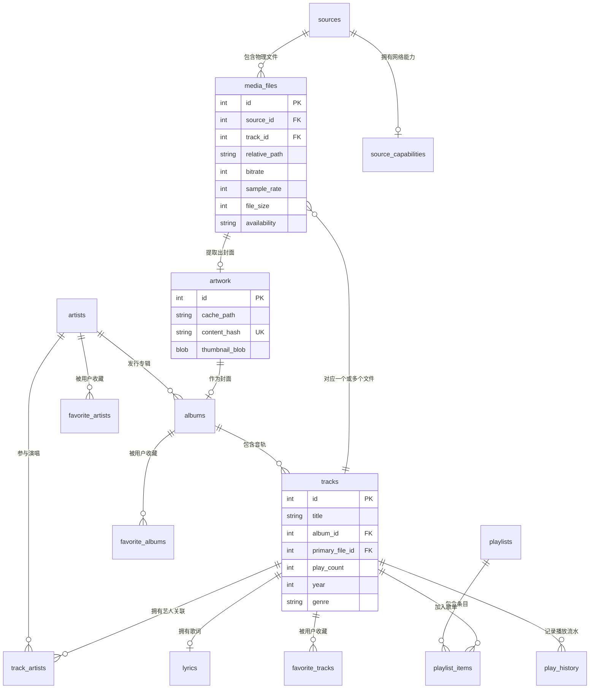

# Lumo 前后端交互与全栈架构设计文档

> **版本**: 2.1.1  
> **全栈架构**: Tauri 2.x + Vue 3 (前端) + Rust 2021 (后端) + SQLite 3 + Kotlin (Android 桥)  
> **核心契约定义**: [src/api/types.ts](file:///c:/Users/hao/RustroverProjects/lumo/src/api/types.ts) 与 [src-tauri/src/models.rs](file:///c:/Users/hao/RustroverProjects/lumo/src-tauri/src/models.rs)  
> **主命令装配点**: [src-tauri/src/lib.rs](file:///c:/Users/hao/RustroverProjects/lumo/src-tauri/src/lib.rs)

---

## 1. 全栈架构概览与通信模型

### 1.1 进程与通信拓扑
**Lumo（轻音）** 基于 Tauri 2.x 构建，采用典型的双进程/多线程架构。前端运行在平台的系统级原生 Web 视图（Windows WebView2 / Android WebView），后端为高性能 Rust 原生编译二进制引擎。

```
┌────────────────────────────────────────────────────────────────────────┐
│                        Lumo 全栈通信交互拓扑图                         │
├────────────────────────────────────────────────────────────────────────┤
│ 【前端渲染进程 (Webview)】                                             │
│  Vue 3 组件 ──> Pinia Stores ──> api/*.ts (TS 强类型客户端)             │
│                                       │                                │
│                                tauriInvoke AOP                         │
│                                       │                                │
│ ──────────────────────────────────────┼─────────────────────────────── │
│                Tauri IPC 通道 (JSON-RPC / Zero-Copy)                    │
│ ──────────────────────────────────────┼─────────────────────────────── │
│                                       ▼                                │
│ 【后端核心进程 (Rust Engine)】                                         │
│  Tauri Commands (80+ 注册命令) ──> ipc_trace! 耗时/在飞监控            │
│  ├─ services::playback (Symphonia 解码 + Rodio 音频流输出)             │
│  ├─ services::queue (权威播放队列 + queue_watcher_loop 250ms 看门狗)    │
│  ├─ services::scanner (多线程文件遍历 + Lofty 标签解析 + 艺人拆分)     │
│  ├─ services::cache (WebDAV 音频透明本地分块缓存)                      │
│  ├─ services::cover (200x200 JPEG 缩略图生成 + 缓存)                   │
│  └─ repositories (SQLite r2d2 连接池 + WAL 模式 + 23 张表)             │
│                                                                        │
│ 【双向事件推送 (Tauri Events)】                                        │
│  Rust 引擎 ──(playback-progress / status-changed / scan-progress)──> 前端│
│                                                                        │
│ 【自定义 URI Scheme 协议】                                             │
│   ──> CountingSemaphore (4并发)│
└────────────────────────────────────────────────────────────────────────┘
```

### 1.2 三大通信机制规范
1. **Tauri IPC Commands (请求-响应模型)**：
   - 对应前端 `invoke('command_name', args)`；
   - 跨进程基于高效 JSON 序列化，参数由 Serde 自动反序列化；
   - 耗时命令均通过 `#[tauri::command(async)]` 派发至 Tokio 线程池执行，坚决不阻塞 WebView 主消息循环。
2. **Tauri Events (单向广播推送模型)**：
   - 后端通过 `app.emit('event_name', payload)` 向前端广播状态；
   - 涵盖播放进度心跳（`playback-progress`，1Hz）、切歌事件（`playback-track-changed`）、扫描进度（`scan-progress`）、Android 耳机拔出（`lumo-audio-becoming-noisy`）等。
3. **自定义 URI Scheme 协议 (`lumo://`)**：
   - 专用于高效流式拉取封面图片；
   - 支持 HTTP 规范的标准协商缓存（`ETag` / `If-None-Match` / `Last-Modified`），返回 304 Not Modified；
   - 包含**全局计数信号量（CountingSemaphore）限流机制**，防止图片高并发堵塞 IPC 消息通道。

---

## 2. IPC Commands 完整索引清单 (80+ 个命令)

后端在 [src-tauri/src/lib.rs](file:///c:/Users/hao/RustroverProjects/lumo/src-tauri/src/lib.rs) 中集中注册了 9 大业务模块的 80+ 个 IPC 命令：

### 2.1 曲库管理模块 (`commands::library`)

| 命令名称 | 入参 (Payload) | 返回值 | 说明 |
|---|---|---|---|
| `library_get_startup_bundle` | 无 | `StartupBundle` | **启动关键契约**：将曲库计数、歌单列表、首屏30张专辑/艺人、持久化队列打包一次性返回 |
| `library_get_tracks` | `offset: i64, limit: i64, sort_by, sort_order` | `Vec<TrackDTO>` | 分页查询曲库全部歌曲 |
| `library_get_track_ids` | `sort_by, sort_order` | `Vec<i64>` | 获取当前排序下全部歌曲 ID（批量全选核心支撑） |
| `library_get_track_file_info` | `track_id: i64` | `TrackFileInfoDTO` | 查询指定曲目的物理音频格式、码率、文件路径 |
| `library_get_track_versions` | `track_id: i64` | `Vec<TrackVersionDTO>` | 查询同一首歌曲关联的所有物理文件版本 |
| `library_set_primary_file` | `track_id: i64, media_file_id: i64` | `()` | 手动指定歌曲的主播放物理文件 |
| `library_get_playability` | `track_ids: Vec<i64>` | `HashMap<i64, bool>` | 批量检查曲目的可播性（离线云端未缓存/本地丢失检测） |
| `library_get_albums` | `offset: i64, limit: i64, sort_by` | `Vec<AlbumDTO>` | 分页查询专辑列表（内联 200x200 JPEG 缩略图） |
| `library_get_album_by_id` | `album_id: i64` | `Option<AlbumDTO>` | 查询指定专辑详情 |
| `library_get_album_tracks` | `album_id: i64` | `Vec<TrackDTO>` | 查询指定专辑所包含的所有音轨 |
| `library_get_album_count` | 无 | `i64` | 查询曲库专辑总数 |
| `library_get_artists` | `offset: i64, limit: i64` | `Vec<ArtistDTO>` | 分页查询艺人列表 |
| `library_get_artist_by_id` | `artist_id: i64` | `Option<ArtistDTO>` | 查询指定艺人详情 |
| `library_get_artist_albums` | `artist_id: i64` | `Vec<AlbumDTO>` | 查询指定艺人发布的所有专辑 |
| `library_get_artist_tracks` | `artist_id: i64` | `Vec<TrackDTO>` | 查询指定艺人的所有单曲作品 |
| `library_get_artist_stats` | `artist_id: i64` | `ArtistStatsDTO` | 查询艺人收听统计与曲目规模 |
| `library_create_playlist` | `name: String` | `PlaylistDTO` | 创建新播放列表（歌单） |
| `library_get_playlists` | 无 | `Vec<PlaylistDTO>` | 查询所有用户歌单 |
| `library_add_to_playlist` | `playlist_id: i64, track_id: i64` | `()` | 向歌单添加单曲 |
| `library_add_tracks_to_playlist` | `playlist_id: i64, track_ids: Vec<i64>` | `usize` | 批量向歌单添加歌曲 |
| `library_get_playlist_tracks` | `playlist_id: i64` | `Vec<TrackDTO>` | 查询歌单内音轨（按 position 浮点数升序） |
| `library_delete_playlist` | `playlist_id: i64` | `()` | 删除歌单 |
| `library_remove_playlist_item` | `playlist_id: i64, track_id: i64` | `()` | 从歌单中移除指定条目 |
| `library_toggle_favorite` | `track_id: i64` | `bool` | 切换歌曲喜欢状态（返回当前是否喜欢） |
| `library_set_favorite_batch` | `track_ids: Vec<i64>, favorite: bool` | `()` | 批量设置歌曲收藏状态 |
| `library_get_favorite_tracks` | 无 | `Vec<TrackDTO>` | 查询喜欢的全部歌曲 |
| `library_toggle_favorite_album` | `album_id: i64` | `bool` | 切换专辑收藏状态 |
| `library_get_favorite_albums` | 无 | `Vec<AlbumDTO>` | 查询收藏的专辑列表 |
| `library_toggle_favorite_artist`| `artist_id: i64` | `bool` | 切换艺人收藏状态 |
| `library_get_favorite_artists` | 无 | `Vec<ArtistDTO>` | 查询收藏的艺人列表 |
| `library_record_play` | `track_id: i64, duration_ms: i64, completed: bool` | `()` | 记录一次播放流水日志并递增计数 |
| `library_get_recently_played` | `limit: i64` | `Vec<TrackDTO>` | 查询最近播放历史记录 |
| `library_get_lyrics` | `track_id: i64` | `Option<LyricsDTO>` | 获取歌曲同步 LRC 或纯文本歌词 |
| `library_get_smart_playlist` | `kind: String, limit: i64` | `Vec<TrackDTO>` | 获取智能歌单（most_played / recently_added 等） |
| `library_get_insights` | 无 | `LibraryInsightsDTO`| 首页聚合洞察数据（时长统计与Top排行榜） |
| `library_get_folder_contents` | `source_id: i64, path: String` | `FolderContentsResult` | 浏览本地或 WebDAV 物理目录树 |
| `storage_get_db_size` | 无 | `StorageStatsDTO` | 查询 SQLite 数据库与缓存文件所占物理磁盘大小 |

### 2.2 底层音频播放模块 (`commands::playback`)

| 命令名称 | 入参 (Payload) | 返回值 | 说明 |
|---|---|---|---|
| `playback_play` | `track_id: i64` | `TrackDTO` | 立即启动指定歌曲播放（锁外解码、锁内换源） |
| `playback_pause` | 无 | `()` | 暂停底层 Rodio Sink 输出 |
| `playback_resume` | 无 | `()` | 恢复音频播放 |
| `playback_stop` | 无 | `()` | 停止播放并释放解码器句柄 |
| `playback_seek` | `position_ms: u64` | `()` | 跳转至指定播放时间点 |
| `playback_get_pos` | 无 | `u64` | 获取当前实际内容进度毫秒数（经倍速加权矫正） |
| `playback_is_finished` | 无 | `bool` | 探测当前音频流是否已自然播放完毕 |
| `playback_set_volume` | `volume: f32` | `()` | 设置全局音量（0.0 ~ 1.0） |
| `playback_set_speed` | `speed: f32` | `()` | 调节变速播放倍率（0.5x ~ 1.5x） |
| `playback_get_speed` | 无 | `f32` | 获取当前播放倍率 |
| `playback_enqueue_next` | `track_id: i64` | `()` | 向 Rodio Sink 预载下一首音频流（无缝切换） |
| `playback_is_cached` | `track_id: i64` | `bool` | 查询指定远程歌曲是否已下载到本地透明缓存 |
| `playback_get_audio_cache_size`| 无 | `u64` | 获取远程音频本地缓存当前总字节数 |
| `playback_clear_audio_cache` | 无 | `()` | 清空全部远程音频本地缓存文件 |

### 2.3 权威播放队列模块 (`commands::queue`)

| 命令名称 | 入参 (Payload) | 返回值 | 说明 |
|---|---|---|---|
| `playback_set_queue` | `tracks: Vec<TrackDTO>, start_index: usize` | `()` | 向后端全量注入权威播放队列 |
| `playback_play_index` | `index: usize` | `TrackDTO` | 播放当前队列中指定索引的曲目 |
| `playback_queue_state` | 无 | `QueueStateDTO` | 查询当前完整队列列表、游标索引与播放模式 |
| `playback_session_summary` | 无 | `SessionSummaryDTO` | **极简常驻契约**：O(1) 复杂度返回当前曲目与状态 |
| `playback_advance` | `delta: i32` | `Option<TrackDTO>` | 队列游标推进（`+1` 为下一首，`-1` 为上一首） |
| `playback_set_mode` | `mode: String` | `()` | 切换循环模式（normal / repeatAll / repeatOne / shuffle） |

### 2.4 音源与扫描器模块 (`commands::scanner`)

| 命令名称 | 入参 (Payload) | 返回值 | 说明 |
|---|---|---|---|
| `source_add_local` | `path: String, name: String` | `SourceDTO` | 添加本地磁盘音源目录 |
| `source_add_webdav` | `url, username, password, name` | `SourceDTO` | 添加 WebDAV 云端音源（密码存系统钥匙串） |
| `scanner_test_webdav` | `url, username, password` | `WebdavTestResult` | 探测 WebDAV 连通性与 HTTP Range 支持能力 |
| `source_scan` | `source_id: i64` | `()` | 触发指定音源的后台扫描（多线程 + RAII 锁） |
| `source_list` | 无 | `Vec<SourceDTO>` | 获取当前所有已配置音源列表（凭据自动脱敏） |
| `source_remove` | `source_id: i64` | `()` | 移除音源（级联删除关联文件并清理系统钥匙串） |

### 2.5 备份与恢复模块 (`commands::sync`)

| 命令名称 | 入参 (Payload) | 返回值 | 说明 |
|---|---|---|---|
| `sync_get_config` | 无 | `SyncConfigDTO` | 获取跨设备 WebDAV 备份配置（单行约束） |
| `sync_save_config` | `config: SyncConfigDTO` | `()` | 保存 WebDAV 备份配置（密码入系统钥匙串） |
| `sync_browse_webdav` | `path: String` | `Vec<WebdavEntry>` | 浏览 WebDAV 云端备份存储目录 |
| `sync_create_folder` | `path: String` | `()` | 在 WebDAV 远程端新建备份专属文件夹 |
| `sync_upload_now` | 无 | `SyncResult` | **在线热备份**：导出当前 SQLite 备份流并上传 |
| `sync_restore_now` | `remote_filename: String` | `SyncResult` | **灾难恢复**：下载云端快照、事务就地迁移并覆盖 |
| `sync_check_remote` | 无 | `RemoteCheckResult` | 探测远程快照版本号与可用性 |

### 2.6 AI 智能推荐模块 (`commands::ai`)

| 命令名称 | 入参 (Payload) | 返回值 | 说明 |
|---|---|---|---|
| `ai_get_settings` | 无 | `AiSettingsDTO` | 读取大模型配置（API Key 仅返回 `has_key: bool`） |
| `ai_save_settings` | `settings: AiSettingsDTO` | `()` | 保存大模型接入点与密钥至系统凭据库 |
| `ai_test_connection` | 无 | `AiTestResult` | 测试用户自备大模型端点的可用性 |
| `ai_generate_playlist` | `prompt: String, count: usize` | `AiPlaylistResult`| 基于曲库风格提示词异步生成推荐歌单 |
| `ai_cancel_generate` | 无 | `()` | 取消正在执行的 LLM 生成任务 |

### 2.7 桌面模式偏好模块 (`commands::desktop`)

| 命令名称 | 入参 (Payload) | 返回值 | 说明 |
|---|---|---|---|
| `desktop_get_preferences` | 无 | `DesktopPreferences` | 读取桌面模式与窗口几何持久化配置 |
| `desktop_update_preferences`| `prefs: DesktopPreferences` | `()` | 原子更新写入 `desktop_ui_preferences.json` |
| `desktop_set_visual_policy` | `paused: bool` | `()` | 下发视觉策略（迷你/极简下挂起缩略图回填） |
| `desktop_get_resource_stats`| 无 | `ResourceStatsDTO` | 观测当前内存与后台任务计数 |

### 2.8 平台与移动端桥接模块 (`commands::app`)

| 命令名称 | 入参 (Payload) | 返回值 | 说明 |
|---|---|---|---|
| `app_get_version` | 无 | `String` | 获取应用唯一版本号（返回 `"2.1.1"`） |
| `platform_check_audio_permission` | 无 | `bool` | Android: 检查 `READ_MEDIA_AUDIO` 权限 |
| `platform_request_audio_permission`| 无 | `()` | Android: 弹出系统级媒体权限申请对话框 |
| `platform_open_app_settings` | 无 | `()` | 打开操作系统应用设置页 |
| `platform_storage_suggestions` | 无 | `Vec<String>` | 自动扫描系统及主流播放器的音频下载目录 |
| `platform_finish_app` | 无 | `()` | Android: 优雅退出并解除前台服务 |
| `platform_restart_app` | 无 | `()` | 重启应用进程 |

---

## 3. 数据模型与前后端 DTO 契约 (Contract Alignment)

### 3.1 核心 DTO 双向对齐表
前端 TypeScript [types.ts](file:///c:/Users/hao/RustroverProjects/lumo/src/api/types.ts) 与后端 Rust [models.rs](file:///c:/Users/hao/RustroverProjects/lumo/src-tauri/src/models.rs) 保持绝对严格的 1:1 映射：

| 领域实体 | 前端 TypeScript 类型 | 后端 Rust 结构体 | 核心字段说明 |
|---|---|---|---|
| **歌曲传输对象** | `TrackDTO` | `models::TrackDTO` | `id, title, artist, artist_id, album, album_id, duration_ms, format, cover_artwork_id, file_id, is_favorite, source_kind, year, genre, bitrate, sample_rate, bit_depth, file_size` |
| **专辑传输对象** | `AlbumDTO` | `models::AlbumDTO` | `id, title, artist, artist_id, release_year, track_count, cover_artwork_id, cover_thumbnail_base64`（带内联缩略图） |
| **艺人传输对象** | `ArtistDTO` | `models::ArtistDTO` | `id, name, track_count, album_count, avatar_artwork_id` |
| **歌单传输对象** | `PlaylistDTOBackend` | `models::PlaylistDTO` | `id, name, track_count, cover_artwork_id, created_at, updated_at` |
| **启动合并包** | `StartupBundleDTO` | `models::StartupBundle` | `stats_counts, playlists, first_page_albums, first_page_artists, restored_queue` |
| **音源传输对象** | `SourceDTO` | `models::SourceDTO` | `id, name, kind, root_uri, enabled, last_scan_at, last_error, username`（**密码已脱敏**） |

### 3.2 实体分离核心哲学：“文件不是歌曲”
在 Lumo 的数据建模中，最关键的架构决策是将 **业务层歌曲（`tracks`）** 与 **物理媒体文件（`media_files`）** 彻底分离：
- `tracks` 表代表用户心理认知中的“一首歌”（如周杰伦的《晴天》），挂载标题、音轨号、歌词、播放次数、用户评分与用户收藏状态；
- `media_files` 表代表物理介质（如本地固态硬盘上的 `晴天.flac` 与群晖 NAS WebDAV 上的 `晴天.mp3`）；
- `tracks.primary_file_id` 指向当前最佳物理文件。当移动硬盘拔出或离线时，系统自动切换到备用副本或置灰，**绝对不会因为物理文件路径变化而抹除用户的播放历史与收藏记录**。

### 3.3 数据库实体关系模型 (ER Diagram)



---

## 4. 数据库引擎设计与版本化增量迁移

### 4.1 运行时 SQLite 参数与连接池控制
- **引擎**：嵌入式 SQLite 3，由 [rusqlite 0.32](file:///c:/Users/hao/RustroverProjects/lumo/src-tauri/Cargo.toml) 原生静态编译绑定，启用 `bundled` 与 `backup` 在线热备特性；
- **连接池**：基于 [r2d2](file:///c:/Users/hao/RustroverProjects/lumo/src-tauri/src/db.rs) 管理，连接池类型 `r2d2::Pool<SqliteConnectionManager>`；
- **内存治理配置参数**：
  - `DEFAULT_POOL_SIZE = 12`（取代旧版无限制的 24 连接）；
  - `DEFAULT_CACHE_KIB = -8192`（每条连接限定 8MiB 缓存，整体数据库内存开销被严格锁定在 96MiB 上限）；
  - `journal_mode = WAL`（写前日志模式，实现多读一写并发无锁）；
  - `synchronous = NORMAL`（WAL 模式下兼顾速度与断电安全）；
  - `busy_timeout = 5000ms`（防止写入争抢时抛出 SQLITE_BUSY 错误）。

### 4.2 版本化增量迁移演进 (V1 ~ V13 迁移链路)
当前代码的目标架构版本定义为：
```rust
pub const TARGET_SCHEMA_VERSION: i64 = 13;
```
所有迁移均在事务内执行并严格幂等（通过 `add_column_if_missing` 防崩溃防护）：
- **V1**：核心查询复合索引补齐（消除深分页全表扫描）；
- **V2**：为 `albums` 与 `artists` 冗余存储 `track_count` 与 `album_count`，使分页查询从 50ms 降至 0.4ms；
- **V3 ~ V4**：`artwork` 表扩充 `thumbnail_blob`（200x200 JPEG BLOB），后台异步分批回填；
- **V5, V11, V12**：**多艺人智能拆分与关系重建**。扫描与迁移共用 `split_combined_artists`，支持 `&`, `、`, `,`, `;`, `|`, `／`, `+` 以及 `feat./ft.`，自动将组合艺人拆散并重建 `track_artists`/`album_artists`；
- **V6**：WebDAV 历史明文密码迁移至系统加密钥匙串；
- **V7**：艺人头像表关联；
- **V8 ~ V9**：`sync_config` 与 `ai_settings` 单行配置表；
- **V10**：歌词去重并对 `track_id` 加挂唯一约束；
- **V13**：流派表索引补齐与基于 `app_meta` 的增量补扫版本标记。

---

## 5. 音频底层播放流水线与切歌时序

### 5.1 架构亮点：锁外解码 + 锁内换源
音频解码（尤其是针对高码率 FLAC 或远端 WebDAV 串流网络嗅探）可能消耗几百毫秒。如果持有音频管理器互斥锁（Mutex）进行解码，会导致进度条获取和 UI 响应发生严重卡顿。
Lumo 采用**锁外解码**设计：
1. 先在锁外异步构建解码流：`let source = build_decoder(&file_path)?`；
2. 仅在切换底层 Rodio Sink 时进入极短的锁内切换（耗时小于 100 微秒）：`sink.stop(); sink.append(source); sink.play();`。

### 5.2 切歌播放全链路时序图 (Playback Sequence)

```mermaid
sequenceDiagram
    autonumber
    actor User as 用户
    participant UI as 前端 BottomPlayer / TrackRow
    participant Store as Pinia (playerStore)
    participant IPC as Tauri IPC (playback_play)
    participant Service as services::playback
    participant DB as SQLite (repositories)
    participant Decoder as Symphonia 解码器
    participant Sink as Rodio 音频输出 Sink
    participant Watcher as queue_watcher_loop 看门狗

    User->>UI: 双击歌曲行 / 点击播放
    UI->>Store: playerStore.playTrack(trackId)
    Store->>IPC: tauriInvoke('playback_play', { trackId })
    IPC->>Service: PlaybackManager::play(trackId)
    Service->>DB: 查询 primary_file_id 物理路径与格式
    DB-->>Service: 返回物理文件路径 / 远程缓存状态
    Note over Service,Decoder: 关键：在 Manager 锁外构建解码器
    Service->>Decoder: build_decoder(filePath)
    Decoder-->>Service: 返回 DecodedAudioStream
    Note over Service,Sink: 进入短锁，微秒级换源
    Service->>Sink: sink.stop(); sink.append(source); sink.play();
    Service-->>IPC: 返回 TrackDTO
    IPC-->>Store: 更新当前播放歌曲
    Store-->>UI: 触发界面高亮与进度条复位

    loop 看门狗循环 (每 250ms 轮询)
        Watcher->>Sink: 检测播放进度与状态
        Watcher-->>Store: app.emit('playback-progress', { pos_ms })
        Store-->>UI: 驱动前端进度条平滑前进
    end
```

---

## 6. 权威播放队列下沉与看门狗系统

### 6.1 队列权威源下沉至 Rust 端
与常规播放器将播放队列保留在前端 JS 数组中不同，Lumo 将播放队列权威源彻底下沉至 Rust 核心层：
- **Android 切后台保活**：Android 在锁屏或切换应用时，WebView 内部的 JavaScript 定时器和事件循环会被操作系统强制冻结。由于队列权威在 Rust 层，Rust 底层常驻线程能够不依赖前端自主切歌；
- **冷启动与崩溃防御**：队列状态实时持久化在本地 `playback_state.json`，即使应用被意外终止，启动时也能在毫秒级完美恢复。

### 6.2 世代号并发防抖 (`play_generation`)
当用户以极快频率连续敲击“下一曲”按键时，容易导致多次异步解码任务排队重叠。
Rust 端为每个切歌动作分配原子自增的 `play_generation`：
- 当后发任务开始执行解码时，若发现当前世代号已不是最新，**立即短路丢弃已解码流**，消除过时任务排队导致的界面严重延迟。

### 6.3 看门狗常驻循环 (`queue_watcher_loop`)
后台常驻线程以 `250ms` 间隔持续巡检：
1. **进度广播**：折算当前播放时长并每秒向前端发送心跳；
2. **Gapless 无缝预加载**：当检测到当前歌曲剩余播放时长不足 `3秒` 且队列有下一首时，提前解码下一首曲目送入底层音频 Sink 缓冲区，实现零缝隙切歌；
3. **指数退避容错**：遇到损坏文件或网络瞬断时，自动执行退避重试，记录故障项并安全跳至下一首，杜绝死循环刷屏。

---

## 7. 封面缩略图子系统与并发限流协议

### 7.1 自定义协议 `lumo://artwork` 与 CountingSemaphore 限流
Windows WebView2 底层架构决定了：自定义 URI Scheme 的 HTTP 网络请求与 IPC invoke 共享渲染进程的网络线程池。当网格滚动时，瞬间发起的 30+ 封面请求会耗尽线程池，导致后续所有 IPC 指令排队 1~2 秒。

后端在 [src-tauri/src/lib.rs](file:///c:/Users/hao/RustroverProjects/lumo/src-tauri/src/lib.rs) 中实现了严格的计数信号量：
```rust
static ARTWORK_SEMAPHORE: CountingSemaphore = CountingSemaphore::new(4);
```
- **最大 4 并发限流**：封面请求超出 4 个时在后台排队，为 IPC 命令强制留出专属通道；
- **锁外 I/O**：先在 SQLite 中以 0.1ms 查出缓存路径并立即归还连接，随后在无锁状态下执行磁盘原图读取与 ETag 比对；
- **304 缓存返回**：完全遵照 HTTP 规范，命中 ETag 即刻返回空 Body 的 304 响应。

### 7.2 后台异步缩略图回填 (`backfill_artwork_thumbnails`)
对于首次导入的大规模曲库：
- 应用在独立后台线程遍历 `thumbnail_blob IS NULL` 的记录，调用 `image` crate 生成 200×200 JPEG 缩略图；
- **分批事务提交**：每 50 张图片作为一个事务提交，批次之间主动 `sleep(50ms)`，消除写放大并杜绝 CPU 占满；
- **视觉策略门禁**：在极简模式或迷你播放栏模式下（`policy.visual_paused()`），回填线程自动在批次边界优雅挂起，直至用户恢复完整模式。

---

## 8. WebDAV 远程串流与透明本地分块缓存

### 8.1 HTTP Range 探测与分块流式播放
针对自建 NAS（群晖、QNAP、AList）或云存储 WebDAV：
- 客户端在添加音源时主动探测远程端点是否支持 `Accept-Ranges: bytes`；
- 播放时发起带 `Range: bytes=0-` 请求，基于 Reqwest (rustls) 实现流式边缓冲边解码，首音出声延迟低于 300ms。

### 8.2 透明本地缓存机制 (`AudioCache`)
- **RAII DownloadGuard**：全局静态标记，防止多线程针对同一远端文件重复触发重复下载；
- **原子落盘**：先下载至 `.tmp` 临时文件，下载完成后严格校验下载字节数与数据库 `file_size` 是否一致，拦截截断文件，最后原子重命名（Atomic Rename）为正式缓存；
- **容量上限与近似 LRU 淘汰**：默认设定 2GB 缓存上限。当新下载导致总容量超标时，依据最近实际收听时间（mtime）淘汰最陈旧的音频缓存文件。

---

## 9. 系统凭据管理与网络隐私安全规范

### 9.1 双轨制凭据存储安全架构
| 运行环境 | 存储介质 | 加密与存储机制 |
|---|---|---|
| **桌面端 (Windows / macOS)** | **操作系统钥匙串 (Keyring)** | 密码存入 Windows Credential Manager 或 macOS Keychain，SQLite 数据库仅保存随机 UUID 引用句柄（`username##kr:<uuid>`）。 |
| **移动端 (Android)** | **设备专用熵加密 (Device Secret)** | 从应用沙箱私有随机种子文件（`.device_secret`）结合路径哈希生成 32 字节密钥，通过 XOR + Base64 密封加密存储为 `v2:seal:...`。 |

> **IPC 明文禁传原则**：Rust 端所有含敏感凭据的结构体字段均标有 `#[serde(skip_serializing)]`，通过 IPC 传向前端时自动抹除，前端仅能获得脱敏后的用户名或 `has_key: true` 标记。删除音源时同步物理清除钥匙串。

### 9.2 联网行为机器门禁 (Network Registry Guard)
项目在 [scripts/check-network-registry.mjs](file:///c:/Users/hao/RustroverProjects/lumo/scripts/check-network-registry.mjs) 中配置了严苛的 CI 门禁：
- 代码中所有涉及外网 HTTP 调用的源码行，必须在行末标注 `// 联网行为: §2X` 注释；
- 调用的域名必须全量登记在 [resources/doc/product/NETWORK_BEHAVIOR.md](file:///c:/Users/hao/RustroverProjects/lumo/resources/doc/product/NETWORK_BEHAVIOR.md) 白名单中；
- 默认拒绝一切隐式联网，在线歌词与封面抓取均设有用户显式开关。

---

## 10. 统一错误处理体系与 Android 原生桥

### 10.1 强类型统一错误体系 (`AppError`)
```rust
#[derive(thiserror::Error, Debug)]
pub enum AppError {
    #[error("Database error: {0}")]
    Database(#[from] rusqlite::Error),
    #[error("IO error: {0}")]
    Io(#[from] std::io::Error),
    #[error("Network error: {0}")]
    Network(#[from] reqwest::Error),
    #[error("Pool error: {0}")]
    Pool(#[from] r2d2::Error),
    #[error("Internal error: {0}")]
    Internal(String),
    #[error("Not found: {0}")]
    NotFound(String),
}
```
`AppError` 实现 `retry_class(&self) -> &'static str`，将错误划分为 6 大粗分类，看门狗依此去重上报，避免向前端刷出一连串重复 Toast。

### 10.2 Android 原生前台服务与系统事件
在 Android 平台下，通过 JNI 深度整合 Kotlin 层：
- **前台保活服务 (`MediaPlaybackService.kt`)**：绑定系统 `MediaSession`，在状态栏展示常驻通知栏控制器（包含封面、曲名、上一曲、播放/暂停、下一曲）；
- **音频焦点抢占处理**：监听系统音频焦点（来电或导航播报时自动淡出暂停，挂断后自动恢复）；
- **耳机拔出保护**：广播接收 `AudioManager.ACTION_AUDIO_BECOMING_NOISY`，拔出有线耳机或断开蓝牙时立即暂停播放，杜绝公共场合外放尴尬。
