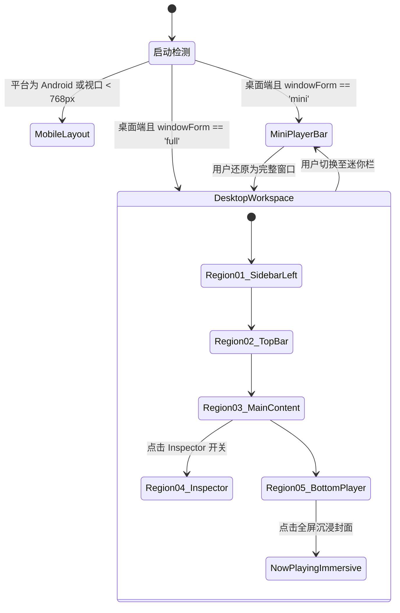
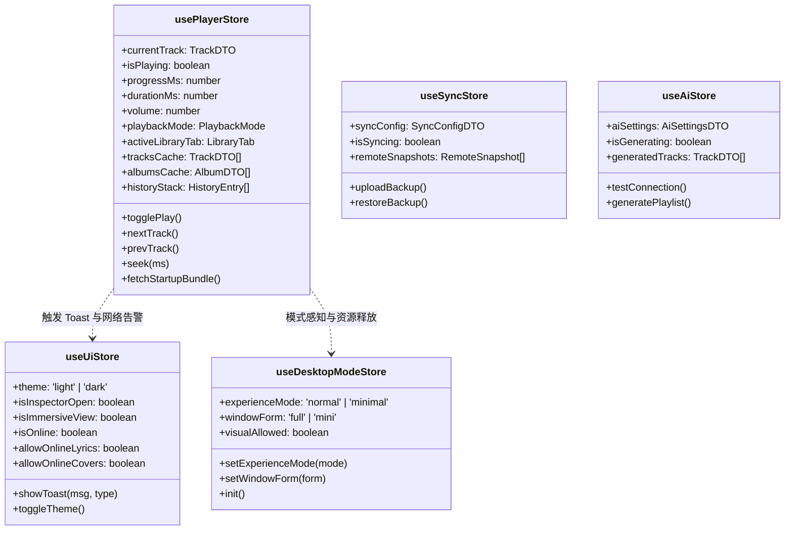

# Lumo 前端架构与组件设计文档

> **版本**: 2.1.1  
> **核心框架**: Vue 3.5 + TypeScript 5.6 + Pinia 3.0 + Tailwind CSS v4 + Vite 6  
> **容器集成**: Tauri 2.x (Windows x64 / Android aarch64)  
> **源码主目录**: [src/](file:///c:/Users/hao/RustroverProjects/lumo/src/)

---

## 1. 前端架构全景与技术选型

### 1.1 架构设计理念
**Lumo（轻音）** 前端架构围绕“**本地优先（Local-First）**、**轻量低耗（Lightweight）**、**响应敏捷（Instant Response）**”三大核心诉求构建。与传统基于 Electron 的流媒体应用（通常启动内存 300~700MB）不同，Lumo 基于 Tauri 2.x 的原生 WebView 运行，前端代码完全由纯原生 TypeScript + Vue 3 构成，**未引入任何重量级第三方 UI 组件库**（如 Element Plus、Naive UI 等），所有界面控件均由自研 LDL 体系纯手工打造。

```
┌────────────────────────────────────────────────────────────────────────┐
│                        Lumo 前端分层架构全景图                         │
├────────────────────────────────────────────────────────────────────────┤
│ 【表现层】 View & Layouts                                              │
│  桌面端五区工作台 (App.vue) │ 迷你播放栏 (MiniPlayer) │ 移动端 (MobileLayout) │
│  ├─ 顶部导航/搜索 (TopBar)  ├─ 底部播放控制 (BottomPlayer)            │
│  ├─ 左侧曲库分面 (Sidebar)  ├─ 右侧检查器 (SidebarRight / Inspector)  │
│  └─ 业务视图 (Home / Album / Artist / TrackList / Folder / Settings)   │
├────────────────────────────────────────────────────────────────────────┤
│ 【共享组件 & 交互体系】 Shared Components & TrackList                 │
│  TrackRow (40px/56px) │ VirtualList 虚拟列表 │ LyricsView rAF 歌词   │
│  BatchActionBar 批量  │ AppToast 全局提示    │ VolumeKnob 实体旋钮   │
├────────────────────────────────────────────────────────────────────────┤
│ 【组合式业务逻辑】 Composables                                        │
│  usePlatform (双端)   │ useVirtualList (性能)│ useScrollRestore (记忆)│
│  useBatchSelect (多选)│ useCoverColor (取色) │ useArtworkSrc (封面)  │
│  useAutoScrollbar     │ useMobileBack (返回) │ useWindowPersistence  │
├────────────────────────────────────────────────────────────────────────┤
│ 【状态管理中心】 Pinia Stores                                          │
│  usePlayerStore (播放/曲库/导航) │ useUiStore (主题/Toast/沉浸大屏)   │
│  useDesktopModeStore (双维模式)  │ useSyncStore │ useAiStore         │
├────────────────────────────────────────────────────────────────────────┤
│ 【通信与 IPC 抽象层】 API & Types                                      │
│  types.ts (DTO 契约) │ library / playback / queue / scanner / sync API │
│  tauriInvoke.ts (AOP 环绕切面 / 耗时探针 / in-flight 计数)            │
├────────────────────────────────────────────────────────────────────────┤
│ 【基础设施与运行时】 Infrastructure                                    │
│  Tauri 2 IPC Bridge (Invoke / Events) │ lumo://artwork 自定义协议     │
└────────────────────────────────────────────────────────────────────────┘
```

### 1.2 关键技术选型清单

| 领域 | 选型 | 版本 | 选型考量与工程决策 |
|---|---|---|---|
| **核心视图框架** | **Vue** | `3.5.13` | 采用 `<script setup lang="ts">` 组合式 API，深度细粒度响应式系统，零运行时虚拟 DOM 开销优化。 |
| **开发语言** | **TypeScript** | `~5.6.2` | 严格模式编译，全链路对齐后端 Rust DTO 类型，消除动态类型隐患。 |
| **状态管理** | **Pinia** | `^3.0.1` | 去中心化轻量 Store，天然支持 TypeScript 类型推导与 DevTools 时间旅行调试。 |
| **样式与原子化** | **Tailwind CSS** | `^4.3.0` | 采用 Vite 原生 `@tailwindcss/vite` 插件与 CSS 变量 `@theme`，无 JS 运行时样式开销。 |
| **图标体系** | **Lucide Vue Next** | `^0.577.0` | 统一 1.5px 轻量级 SVG 线框图标，支持 currentColor 自动变色。 |
| **构建工具** | **Vite** | `^6.0.3` | 秒级冷启动与 HMR，精确固定端口 `1520`（避免与 Windows Hyper-V 动态端口冲突）。 |
| **测试框架** | **Vitest** | `^4.1.11` | 基于 `happy-dom` 20.x 的无头 DOM 极速测试框架，全量覆盖组合式函数与关键组件。 |

---

## 2. 前端工程目录结构与职责分工

```
lumo/src/
├── main.ts                        # 前端主入口：创建 Vue 实例、挂载 Pinia、全局异常捕获
├── App.vue                        # 顶层布局容器：三态模式分流、全局键盘快捷键、窗口持久化
├── style.css                      # Tailwind v4 全局样式：LDL 设计 Token、双主题、Auto-Hide 滚动条
├── vite-env.d.ts                  # 全局类型定义（如 __APP_VERSION__ 常量）
├── api/                           # Tauri IPC 接口客户端层
│   ├── types.ts                   # 前后端对齐的 DTO 强类型契约定义
│   ├── library.ts                 # 曲库查询、统计、收藏、歌词、可播性 API
│   ├── playback.ts                # 播放、暂停、进度 Seek、音量、倍速、缓存 API
│   ├── queue.ts                   # 播放队列权威管理、切歌、循环模式 API
│   ├── scanner.ts                 # 本地及 WebDAV 目录扫描与音源管理 API
│   ├── sync.ts                    # WebDAV 整库快照备份与覆盖恢复 API
│   └── ai.ts                      # AI 智能电台推荐歌单 API
├── config/                        # 应用配置
│   ├── appInfo.ts                 # 应用名称、宣传语及单一事实源版本号导出
│   └── desktopModes.ts            # 桌面多模式参数与特性开关
├── composables/                   # 业务逻辑组合式函数
│   ├── usePlatform.ts             # 平台环境感知 (Windows / Android / Web) 及响应式断点
│   ├── useVirtualList.ts          # 大曲库虚拟滚动高性能渲染器
│   ├── useBatchSelect.ts          # 歌曲批量多选与跨页操作管理
│   ├── useScrollRestore.ts        # 跨页面与 Tab 切换的滚动位置记忆与还原
│   ├── useCoverColor.ts           # 封面图片 Canvas 离屏实时主色/辅色提取器
│   ├── useArtworkSrc.ts           # 封面缩略图与原图协议 URL 门禁管道
│   ├── useAutoScrollbar.ts        # 滚动条活动时显示、静止自动隐藏监听器
│   ├── useMobileBack.ts           # Android 物理实体与手势返回键导航栈管理
│   └── useWindowPersistence.ts    # 桌面窗口尺寸/定位几何持久化协调器
├── stores/                        # Pinia 状态仓库
│   ├── player.ts                  # 应用最核心状态机（播放控制、当前曲目、曲库缓存、导航栈）
│   ├── ui.ts                      # 全局 UI 状态（日夜主题、Toast 调度、沉浸大屏、网络在线监听）
│   ├── desktopMode.ts             # 桌面双维体验状态机（正常/极简 × 完整/迷你）
│   ├── sync.ts                    # WebDAV 备份恢复状态管理
│   └── ai.ts                      # AI 推荐设置与异步生成状态
├── utils/                         # 通用工具函数
│   ├── tauriInvoke.ts             # Tauri invoke AOP 封装（统一耗时打印、慢调用告警、并发探针）
│   └── index.ts                   # 通用工具（时长格式化、路径解析、数组去重）
└── components/                    # UI 组件库（完全自研）
    ├── layout/                    # 桌面端核心布局框架组件
    │   ├── TopBar.vue             # Region 02: 顶部控制栏（搜索、模式、主题、无边框窗口按键）
    │   ├── SidebarLeft.vue        # Region 01: 左侧主导航（曲库分面、歌单列表、品牌 Logo）
    │   ├── MainContent.vue        # Region 03: 主内容呈现区（条件路由派发宿主）
    │   ├── SidebarRight.vue       # Region 04: 右侧检查器 Inspector（正在播放、歌词、队列浮层）
    │   ├── BottomPlayer.vue       # Region 05: 底部播放控制器（曲目信息、播放五键、实体音量旋钮）
    │   ├── NowPlayingImmersive.vue# 全屏沉浸式播放大屏（Aura Halo 呼吸光晕、GPU 悬浮大图、双栏歌词）
    │   └── MiniPlayerBar.vue      # 桌面迷你播放栏模式独立紧凑布局 (560×96)
    ├── content/                   # 业务视图组件
    │   ├── HomeView.vue           # 首页聚合视图（听歌时长、排行榜、曲库概览统计）
    │   ├── AlbumGrid.vue / AlbumDetail.vue # 专辑流式网格 / 专辑详情音轨
    │   ├── ArtistGrid.vue / ArtistDetail.vue # 艺人肖像网格 / 艺人作品分组
    │   ├── PlaylistDetail.vue     # 歌单详情（支持拖拽排序与批量加歌）
    │   ├── SmartPlaylistView.vue  # 智能歌单（播放最多、最近添加、未曾播放）
    │   ├── FavoritesView.vue      # 收藏夹聚合视图（包含歌曲、专辑、歌手子视图）
    │   ├── RecentlyPlayed.vue     # 最近播放流水记录
    │   ├── FolderView.vue         # 物理文件夹目录树浏览
    │   ├── GlobalSearch.vue       # 全局即时搜索面板（歌曲/专辑/艺人分组）
    │   ├── AiPlaylistView.vue     # AI 智能电台提示词生成视图
    │   ├── MinimalEntityList.vue  # 极简体验模式专用文字高密度排版列表
    │   └── Settings.vue           # 设置中心（外观/网络隐私/数据源/存储清理/备份）
    ├── mobile/                    # 移动端 (Android) 专属完整视图与适配组件
    │   ├── MobileLayout.vue       # 移动端整套顶层骨架（含 safe-area 避让）
    │   ├── MobileHeader.vue       # 移动端顶部标题栏
    │   ├── MobileTabBar.vue       # 移动端底部 4-Tab 切换栏
    │   ├── MobileContentView.vue  # 移动端视图切换核心宿主
    │   ├── MobileNowPlaying.vue   # 移动端全屏播放面板（手势下滑收起）
    │   ├── MobileSongRow.vue      # 移动端触控优化的歌曲条目 (56px)
    │   ├── MobileAlbumCard.vue    # 移动端双列网格卡片
    │   ├── MobileSearch.vue       # 移动端独立搜索页
    │   └── ActionSheet.vue        # 移动端底部操作浮层（Teleport 抽屉）
    └── shared/                    # 跨模块通用与原子组件
        ├── trackList/             # 统一歌曲列表子系统
        │   ├── TrackRow.vue       # 单曲行组件（支持多选、正在播放高亮、可播性置灰）
        │   ├── TrackListHeader.vue# 表头组件（包含自定义显示列菜单）
        │   ├── columns.ts         # 列宽策略与容器自适应规则
        │   └── useTrackColumns.ts # 歌曲列动态配置 Hook
        ├── LyricsView.vue         # 自定义 rAF 动画平滑滚动同步歌词
        ├── BatchActionBar.vue     # 批量操作底栏（批量加歌单、批量收藏、批量删除）
        ├── AppToast.vue           # 全局 Toast 轻提示浮层
        ├── CreatePlaylistModal.vue# 新建歌单弹窗
        └── AnalogKnob.vue         # 物理质感音量旋钮（带 SVG 刻度与手势）
```

---

## 3. 三态布局系统与模式切换 (Layout System)

前端在 [App.vue](file:///c:/Users/hao/RustroverProjects/lumo/src/App.vue) 中实现了精密的三态布局流转，覆盖大屏桌面、极简小窗与触控移动端：



### 3.1 桌面双维体验四象限 (Desktop Two-Dimensional Modes)
项目在 [desktopMode.ts](file:///c:/Users/hao/RustroverProjects/lumo/src/stores/desktopMode.ts) 中将桌面体验正交拆解为两个完全独立的维度：
1. **体验模式（Experience Mode）**：
   - `normal`（正常模式）：完整视觉、毛玻璃、过渡动效、封面图片网格；
   - `minimal`（极简模式）：`data-experience="minimal"` 注入 `<html>`，关闭所有 `backdrop-filter`，动画缩短至 0.01ms，网格回退为 [MinimalEntityList.vue](file:///c:/Users/hao/RustroverProjects/lumo/src/components/content/MinimalEntityList.vue) 纯文字列表，大幅降低 GPU 与内存开销。
2. **窗口形态（Window Form）**：
   - `full`（完整窗口）：标准五区工作台（1200×720）；
   - `mini`（迷你播放栏）：紧凑悬浮窗口（560×96），仅保留核心切歌、进度控制与置顶，卸载大量浏览组件。

### 3.2 模式切换时的资源清理与状态保活
- **进入 Mini 模式**：
  - 自动清空前端占据大量内存的曲库浏览大数组（如几万首曲目列表），仅保留常驻轻量播放会话（`playback_session_summary`）；
  - 停止封面取色、暂停歌词计算、暂停后台缩略图回填（下发 `desktop_set_visual_policy`）；
  - 记录当前浏览位置的锚点窗口（Anchor Window）。
- **返回 Full 模式**：
  - 自动从原子持久化的 `desktop_ui_preferences.json` 恢复上一次窗口位置与尺寸；
  - 依据锚点智能播种首批 200 行数据，实现零闪烁平滑还原。

---

## 4. 状态驱动的导航路由机制 (State-Driven Navigation)

### 4.1 架构取舍：为什么不用 `vue-router`？
Lumo 在立项之初就放弃了传统的 `vue-router`，选用基于 Pinia 的状态驱动导航机制：
1. **单窗口桌面应用特质**：桌面音乐播放器不是多页面 Web，视图切换通常伴随复杂的跨面板联动（例如在播放歌曲的同时浏览曲库，右侧抽屉展示队列，底部播放栏永不重载）。
2. **极致内存与状态保留**：`vue-router` 在频繁切换与嵌套路由时会产生复杂的 RouterView 挂载/卸载开销；状态驱动模式配合 `v-if` 与组件级滚动记忆，能实现精确到像素级的快速复原。
3. **避免浏览器路由干扰**：Tauri 容器中无需处理前端真实的 URL hash 或 history 变化，避免与系统原生回退逻辑发生混乱。

### 4.2 路由核心状态与视图派发
核心路由状态全部收敛在 [src/stores/player.ts](file:///c:/Users/hao/RustroverProjects/lumo/src/stores/player.ts) 中：

```typescript
// 核心一级导航 Tab
export type LibraryTab =
  | '首页' | '全部歌曲' | '专辑' | '艺术家' | '文件夹'
  | '最近播放' | '播放列表' | '智能歌单'
  | '喜欢的音乐' | '收藏的专辑' | '收藏的歌手'
  | 'AI 电台' | '设置';

// 导航实体与历史栈状态
activeLibraryTab: ref<LibraryTab>('首页'),
activeAlbumId: ref<number | null>(null),
activeArtistId: ref<number | null>(null),
activePlaylistId: ref<number | null>(null),
historyStack: ref<HistoryEntry[]>([]),
historyIndex: ref<number>(-1),
```

在 [MainContent.vue](file:///c:/Users/hao/RustroverProjects/lumo/src/components/layout/MainContent.vue) 中，通过计算属性声明式分发子视图：
- 若 `isAlbumDetailView` 为真，渲染 [AlbumDetail.vue](file:///c:/Users/hao/RustroverProjects/lumo/src/components/content/AlbumDetail.vue)；
- 若 `isArtistDetailView` 为真，渲染 [ArtistDetail.vue](file:///c:/Users/hao/RustroverProjects/lumo/src/components/content/ArtistDetail.vue)；
- 若 `isGlobalSearchActive` 为真，渲染 [GlobalSearch.vue](file:///c:/Users/hao/RustroverProjects/lumo/src/components/content/GlobalSearch.vue)；
- 否则根据 `activeLibraryTab` 映射渲染对应的一级视图。

### 4.3 滚动位置记忆还原 (`useScrollRestore`)
使用 [src/composables/useScrollRestore.ts](file:///c:/Users/hao/RustroverProjects/lumo/src/composables/useScrollRestore.ts) 组合式函数：
- 为每个 Tab 和详情页生成唯一的命名空间 Key（如 `scroll:album-detail:42`、`scroll:tab:全部歌曲`）；
- 在组件离开时（或视口切换前）记录当前容器的 `scrollTop`；
- 在重新进入视图时，在 `nextTick` 后平滑将滚动条还原至历史位置，保证深度浏览无跳变。

---

## 5. 桌面端核心布局组件深度剖析

### 5.1 [SidebarLeft.vue](file:///c:/Users/hao/RustroverProjects/lumo/src/components/layout/SidebarLeft.vue) (左侧导航栏)
- **规格**：固定宽度 `220px`，高度自适应填满，背景色 `--bg-canvas`。
- **职责**：
  - 顶部预留 Windows 原生无边框拖拽区域（`data-tauri-drag-region`）；
  - 品牌标识展示：`LUMO`（20px Bold）与版本标签；
  - 曲库分面主菜单：首页、全部歌曲、专辑、艺术家、文件夹；
  - 收藏夹菜单：喜欢的音乐、收藏的专辑、收藏的歌手；
  - 歌单列表与创建按钮（弹出 [CreatePlaylistModal.vue](file:///c:/Users/hao/RustroverProjects/lumo/src/components/shared/CreatePlaylistModal.vue)）；
- **设计细节**：严格遵循 LDL v2.0，菜单项高度统一为 30px，激活项以左侧 6px 橙色圆点标识，**已全面移除可能引起布局抖动的尾部曲目数量计数**。

### 5.2 [TopBar.vue](file:///c:/Users/hao/RustroverProjects/lumo/src/components/layout/TopBar.vue) (顶部控制栏)
- **规格**：高度 `60px`，背景色 `--bg-canvas`，右侧带窗口无边框控制组。
- **职责**：
  - **历史导航控制器**：前进（Forward）、后退（Back）、主页（Home）三键组合，根据 `canGoBack / canGoForward` 动态响应；
  - **全局即时搜索框**：内置 300ms 防抖，支持键盘快捷键聚焦（`Ctrl+F` 或 `/` 快捷键），支持快速清除输入；
  - **体验模式切换器**：正常 / 极简模式切换；
  - **迷你播放栏触发器**：调用 `desktopModeStore.setWindowForm('mini')`；
  - **日夜主题切换键**：日间（Warm White）/ 暗色（Warm Industrial Dark）即时切换；
  - **Inspector 抽屉开关**：控制右侧检查器的展开与隐藏；
  - **无边框原生窗口控制**：最小化、最大化/还原、关闭窗口（通过 Tauri `getCurrentWindow()` 原生调用）。

### 5.3 [SidebarRight.vue](file:///c:/Users/hao/RustroverProjects/lumo/src/components/layout/SidebarRight.vue) (Inspector 检查器)
- **规格**：固定宽度 `320px`，以浮层形式位于右侧，高度占满内容区，`z-index: 40`。
- **职责**：
  - 包含两大 Tab：**正在播放（Now Playing）** 与 **播放列表（Queue）**；
  - **正在播放 Tab**：呈现当前曲目高质量正方形大封面、标题与多艺人信息、当前物理文件版本切换下拉框（本地无损 vs WebDAV 副本）、同步歌词预览面板；
  - **播放列表 Tab**：展现 Rust 后端权威播放队列的当前排队曲目，支持双击插播、单曲移除与一键清空队列。

### 5.4 [BottomPlayer.vue](file:///c:/Users/hao/RustroverProjects/lumo/src/components/layout/BottomPlayer.vue) (底部播放控制器)
- **规格**：固定高度 `92px`，通过 Divider D 贯穿主界面，背景色 `--bg-content`。
- **职责**：
  - **左侧曲目区**：48×48 正方形封面（支持点击展开沉浸大屏）、曲名、艺人、快速收藏心形按钮、添加歌单按钮；
  - **中间主控区 (绝对居中)**：
    - 上行：顺序/单曲/随机循环模式切换、上一曲、46px 核心播放大键、下一曲、倍速播放（0.5x~1.5x）；
    - 下行：当前播放时间（等宽 Mono）、高精度交互进度条（支持 Hover 时间提示微气泡、拖拽 Scrubbing）、曲目总时长；
  - **右侧扩展区**：
    - 音质格式徽章（如 `FLAC 96kHz`）；
    - 同步歌词弹层快捷入口；
    - 物理质感音量旋钮（带 SVG 刻度圆环、实时数值及滚轮无级调节）。

### 5.5 [NowPlayingImmersive.vue](file:///c:/Users/hao/RustroverProjects/lumo/src/components/layout/NowPlayingImmersive.vue) (全屏沉浸播放大屏)
- **规格**：覆盖全窗口（`w-screen h-screen`，`z-index: 200`），自底向上抽屉式平滑滑入（250ms ease-out）。
- **职责**：
  - **Aura Halo（呼吸光晕场）**：通过离屏 Canvas 提取当前封面主色与辅色，在背景生成带有 GPU 模糊的呼吸环境光；
  - **黑胶级大封面排版**：大尺寸唱片封面，带微阴影与光泽感；
  - **双栏同步歌词**：右侧展示基于 [LyricsView.vue](file:///c:/Users/hao/RustroverProjects/lumo/src/components/shared/LyricsView.vue) 的逐句高亮滚动歌词；
  - **极简模式硬门禁**：极简模式下（`desktopModeStore.visualAllowed == false`）严格禁止挂载，防止过量 GPU 消耗。

---

## 6. 统一歌曲列表组件包 (`src/components/shared/trackList/`)

歌曲列表是全应用复杂度最高的数据密集型组件，项目将其彻底解耦为可复用的独立子系统：

```
src/components/shared/trackList/
├── TrackRow.vue          # 单曲行组件 (负责渲染、交互、四态高亮)
├── TrackListHeader.vue   # 表头组件 (负责排序、列宽拖拽、列可见性配置)
├── columns.ts            # 列定义模型 (宽度范围、自适应权重、默认显示)
└── useTrackColumns.ts    # 响应式列配置 Hook (管理持久化与列收纳)
```

### 6.1 列模型与自适应收纳规则 (`columns.ts`)
支持多达 11 个元数据字段列：
1. `index`：行序号 / 播放动效
2. `favorite`：收藏心形
3. `title`：曲目标题（主列，自适应弹性伸缩 `flex-1`）
4. `artist`：艺人名称
5. `album`：专辑名称
6. `duration`：时长（等宽）
7. `audioInfo`：音质格式与采样率（如 `FLAC 24/96`）
8. `year`：发行年份
9. `genre`：流派
10. `fileSize`：文件大小
11. `actions`：更多操作菜单

**自适应列收纳算法**：
监听主内容区容器物理宽度（ResizeObserver）：
- 容器宽度 `< 800px`：自动隐藏 `fileSize` 与 `genre`；
- 容器宽度 `< 700px`：自动隐藏 `year`；
- 容器宽度 `< 600px`：自动隐藏 `audioInfo`；
- 容器宽度 `< 500px`：仅保留 `index`、`favorite`、`title`、`duration` 核心字段。

### 6.2 高性能单曲行渲染 (`TrackRow.vue`)
- **固定行高**：桌面端严格固定 `40px`，移动端严格固定 `56px`（虚拟滚动硬依赖）；
- **状态高亮**：
  - 正在播放时，应用 `.playing-row` 类，左侧通过 `::before` 绝对定位渲染 2px 暖橘色竖条；
  - 标题切换为 `text-brand-orange`；
  - 序号处切换为跳动的律动等化器指示器（[EqualizerIndicator.vue](file:///c:/Users/hao/RustroverProjects/lumo/src/components/shared/EqualizerIndicator.vue)）；
- **可播性置灰守卫（Playability Guard）**：
  - 若曲目来源为远程 WebDAV 且处于离线未缓存状态，或本地物理文件已被移除，整行自动置灰（`opacity-40`），阻止双击切歌并给出友好提示。

---

## 7. Pinia 状态管理架构

前端采用 5 个职责明晰的 Pinia Store 集中管理全局响应式状态：



### 7.1 `usePlayerStore` (核心播放与曲库状态机)
- **代码规模**：约 3000 行，承担全系统的核心音频状态与数据缓存。
- **状态划分**：
  1. *播放机状态*：`currentTrack`、`isPlaying`、`progressMs`、`durationMs`、`volume`、`playbackRate`、`playbackMode`（normal/repeatAll/repeatOne/shuffle）；
  2. *曲库实体缓存*：`tracksCache`、`albumsCache`、`artistsCache`、`playlistsCache`、`sourcesCache`；
  3. *导航与历史栈*：`activeLibraryTab`、`activeAlbumId`、`activeArtistId`、`activePlaylistId`、`historyStack`、`historyIndex`；
  4. *批量操作*：`selectedTrackIds`、`isBatchMode`；
- **冷启动聚合拉取 (`fetchStartupBundle`)**：
  - 启动时单一 IPC 请求拉取曲库计数、歌单列表、首屏专辑、首屏艺人及恢复队列，替代原先分散的 7+ 次 IPC 请求。

### 7.2 `useUiStore` (全局 UI 偏好与 Toast 调度)
- **主题管理**：`theme: 'light' | 'dark'`，与 `document.documentElement` 上的 `data-theme` 属性双向绑定；
- **在线隐私门禁**：`allowOnlineLyrics`（在线歌词开关）、`allowOnlineCovers`（网易云/iTunes 封面抓取开关），贯彻“默认离线”原则；
- **单例 Toast 调度**：支持 `info`、`success`、`warning`、`error` 4 级提示，自动防抖去重。

### 7.3 `useDesktopModeStore` (桌面双维模式控制器)
- 管理体验模式（`normal` / `minimal`）与窗口形态（`full` / `mini`）；
- 核心 Getter `visualAllowed`：当处于极简或迷你模式时返回 `false`，界面据此卸载重型视觉组件。

---

## 8. Composables 组合式函数体系

| 组合式函数 | 源码文件 | 核心职责与设计要点 |
|---|---|---|
| `usePlatform` | [usePlatform.ts](file:///c:/Users/hao/RustroverProjects/lumo/src/composables/usePlatform.ts) | 区分 Windows / Android / Web 运行时，提供响应式视口断点 `isMobile`（`< 768px`）。 |
| `useVirtualList` | [useVirtualList.ts](file:///c:/Users/hao/RustroverProjects/lumo/src/composables/useVirtualList.ts) | 基于固定行高（40px/56px）计算视口可视区间，仅渲染真实可见的 DOM 节点，支撑 30k+ 曲库流畅滚动。 |
| `useBatchSelect` | [useBatchSelect.ts](file:///c:/Users/hao/RustroverProjects/lumo/src/composables/useBatchSelect.ts) | 管理 Shift 连续多选、Ctrl 点选、全选后端大结果集，与浮动工具栏 [BatchActionBar.vue](file:///c:/Users/hao/RustroverProjects/lumo/src/components/shared/BatchActionBar.vue) 联动。 |
| `useScrollRestore` | [useScrollRestore.ts](file:///c:/Users/hao/RustroverProjects/lumo/src/composables/useScrollRestore.ts) | 为每个视图 Tab 分配隔离存储空间，自动记忆并恢复视口垂直滚动高度。 |
| `useCoverColor` | [useCoverColor.ts](file:///c:/Users/hao/RustroverProjects/lumo/src/composables/useCoverColor.ts) | 采用离屏 HTML5 Canvas 采样封面主色与辅色，计算加权亮度并输出沉浸式 Aura Halo 渐变参数。 |
| `useArtworkSrc` | [useArtworkSrc.ts](file:///c:/Users/hao/RustroverProjects/lumo/src/composables/useArtworkSrc.ts) | 统一封面 URL 生成逻辑：优先使用内联 Base64 缩略图，回退至 `lumo://artwork` 自定义协议，并处理占位图。 |
| `useAutoScrollbar` | [useAutoScrollbar.ts](file:///c:/Users/hao/RustroverProjects/lumo/src/composables/useAutoScrollbar.ts) | 监听全局与局部滚动事件，滚动时为容器添加 `.scrolling` 类呈现滑块，停止 600ms 后自动淡出隐藏。 |
| `useMobileBack` | [useMobileBack.ts](file:///c:/Users/hao/RustroverProjects/lumo/src/composables/useMobileBack.ts) | 监听 Android 原生物理返回键事件（`lumo-back-pressed`），按“全屏大屏 → 二级详情 → 一级Tab → 退出确认”出栈。 |
| `useWindowPersistence` | [useWindowPersistence.ts](file:///c:/Users/hao/RustroverProjects/lumo/src/composables/useWindowPersistence.ts) | 防抖监听窗口移动（Moved）与缩放（Resized），原子更新持久化到后端偏好配置文件中。 |

---

## 9. 前端 IPC 客户端与 AOP 耗时探针

### 9.1 类型安全 IPC 封装
前端在 `src/api/` 下将后端 Tauri 命令按领域拆解为纯异步函数：
- [library.ts](file:///c:/Users/hao/RustroverProjects/lumo/src/api/library.ts)
- [playback.ts](file:///c:/Users/hao/RustroverProjects/lumo/src/api/playback.ts)
- [queue.ts](file:///c:/Users/hao/RustroverProjects/lumo/src/api/queue.ts)
- [scanner.ts](file:///c:/Users/hao/RustroverProjects/lumo/src/api/scanner.ts)
- [sync.ts](file:///c:/Users/hao/RustroverProjects/lumo/src/api/sync.ts)
- [ai.ts](file:///c:/Users/hao/RustroverProjects/lumo/src/api/ai.ts)

所有接口参数与返回值均由 [types.ts](file:///c:/Users/hao/RustroverProjects/lumo/src/api/types.ts) 强类型约束。

### 9.2 AOP 耗时与并发探针 ([tauriInvoke.ts](file:///c:/Users/hao/RustroverProjects/lumo/src/utils/tauriInvoke.ts))
所有 IPC 调用统一收口经过 `tauriInvoke` 包装层：
```typescript
export async function tauriInvoke<T>(cmd: string, args?: Record<string, unknown>): Promise<T> {
  const seq = ++invokeSeq;
  inFlightCount++;
  const start = performance.now();
  
  // 打印入参日志与在飞请求统计
  console.debug(`[IPC ENTER] #${seq} ${cmd} (in_flight=${inFlightCount})`);
  
  try {
    const result = await invoke<T>(cmd, args);
    const duration = performance.now() - start;
    
    // 慢调用监控：超过 100ms 自动打出警告级别日志
    if (duration > 100) {
      console.warn(`[IPC SLOW] #${seq} ${cmd} 耗时 ${duration.toFixed(1)}ms`);
    }
    return result;
  } catch (error) {
    console.error(`[IPC FAIL] #${seq} ${cmd} 失败:`, error);
    throw error;
  } finally {
    inFlightCount--;
  }
}
```
该机制与后端 `ipc_trace.rs` 完全对称，在排查并发请求拥堵、线程池排队时提供了关键的可观测性支持。

---

## 10. 前端性能攻坚与工程实践总结

1. **解决 Chromium 滚动扣留网络请求问题**：
   - 在 WebView2 启动参数中注入 `--disable-smooth-scrolling`，消除了 Chromium 平滑滚动动画定向扣留 IPC 导致的 2~8 秒卡顿，网格翻页耗时直降 69 倍（至 116ms）。
2. **缩略图内联化消除 N+1 冲击**：
   - 专辑列表接口首屏直接内联 200×200 JPEG Base64 数据，避免首屏瞬间并发几十个 `lumo://artwork` 图片请求阻塞 IPC 消息队列。
3. **极简模式与迷你播放栏硬件减负**：
   - 通过组件互斥挂载、关闭背景模糊、冻结不可见视图的定时器与状态更新，使运行内存大幅缩减。
4. **单例全局滚动条监听**：
   - 摒弃在每个滚动容器单独挂载事件监听器的做法，由 `useAutoScrollbar` 统一在 `window` 上捕获滚动冒泡，显著降低事件监听开销。
