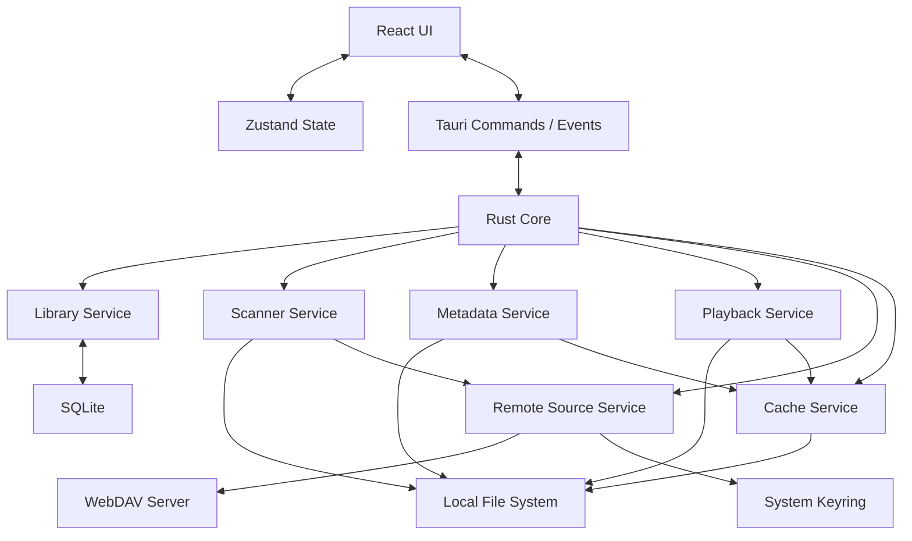
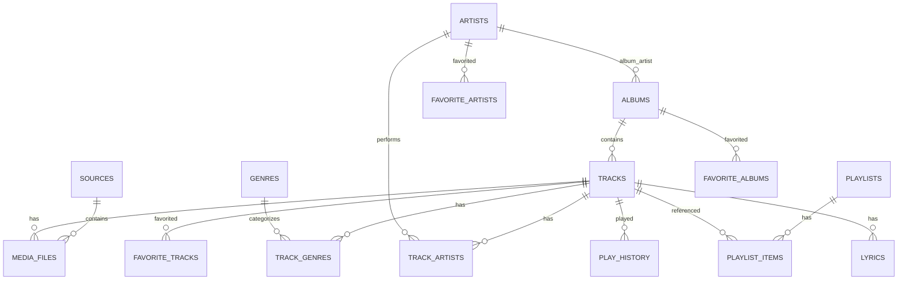
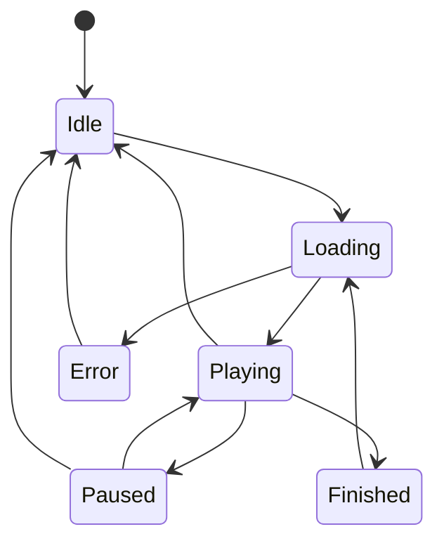

# Lumo（轻音）本地音乐播放器：完整规划与设计

版本：v1.0  
日期：2026-06-08  
定位：本地优先、零自建服务端、跨平台桌面音乐播放器

---

## 1. 结论先行

Lumo 不应该从第一天就做成“全功能跨平台播放器 + WebDAV 云曲库 + 高级音频引擎”。那会把项目拖进音频管线、远程文件协议、缓存一致性和跨平台打包的复杂泥潭。

正确路线是：

1. 首版先做一个可靠的本地播放器。
2. 数据模型从一开始区分“歌曲实体”和“文件位置”，避免后续 WebDAV、去重、多版本音源把数据库推倒重来。
3. WebDAV 作为第二阶段能力引入，先做远程索引与基础播放，不承诺弱网下无限稳定。
4. gapless、ReplayGain、精确 seek、多设备同步等高级能力作为独立里程碑，不进入 MVP 承诺。

Lumo 的核心价值不是“功能最多”，而是把散落在本地目录、NAS、WebDAV 里的音乐用一个干净、快速、可信的桌面体验管理起来。

---

## 2. 产品定义

### 2.1 一句话定位

Lumo 是一款本地优先的跨平台桌面音乐播放器，用本地 SQLite 建立统一曲库索引，支持本地文件播放，并逐步支持 WebDAV/NAS 远程音乐库。

### 2.2 目标用户

- 有本地音乐收藏的人，尤其是 FLAC、MP3、AAC、ALAC 等文件库用户。
- 使用 NAS、WebDAV、自建网盘保存音乐的人。
- 不希望依赖云音乐平台、不希望上传曲库到第三方服务的人。
- 需要现代 UI，但更看重稳定、搜索、整理、播放体验的人。

### 2.3 核心体验

- 第一次打开后，用户选择一个本地音乐目录。
- Lumo 扫描目录、读取标签、建立本地索引。
- 用户可以按歌曲、专辑、艺人浏览和搜索。
- 用户可以播放、收藏、创建歌单、查看最近播放。
- 后续可以添加 WebDAV 来源，并把远程音乐纳入同一个曲库视图。

### 2.4 非目标

首版不做：

- 在线音乐搜索、在线播放、版权曲库。
- 用户账号系统。
- 多设备云同步。
- 社交、评论、分享。
- 专业 DJ 混音、音频编辑。
- 插件市场。
- 移动端 App。

中长期也要谨慎做：

- 歌词在线匹配。
- MusicBrainz 自动补全。
- 多设备同步。
- 高级 DSP、均衡器、音频可视化。

这些功能不是不能做，而是不应该污染第一版架构目标。

---

## 3. 设计原则

### 3.1 本地优先

浏览、搜索、收藏、歌单、历史统计必须走本地数据库。远程来源只在扫描和播放时访问，不应让 UI 操作依赖实时网络。

### 3.2 文件不是歌曲

一个歌曲实体可以有多个文件版本，例如：

- 同一首歌在本地和 NAS 各有一份。
- 同一首歌同时有 MP3 和 FLAC。
- 同一首歌被不同目录重复保存。

因此数据库必须区分：

- `tracks`：音乐实体，用户理解里的“这首歌”。
- `media_files`：具体文件，包含路径、来源、格式、大小、远程 ETag、hash、可用状态。

这是整套系统最重要的架构决策。

### 3.3 高级音频能力延后

基础播放先稳定。gapless、ReplayGain、精确 seek、输出设备切换都必须通过播放引擎抽象逐步补齐，不在第一版硬承诺。

### 3.4 远程来源保守处理

WebDAV 服务端差异很大。不能假设所有服务端都可靠支持 Range、ETag、PROPFIND 深度遍历、中文路径、TLS 证书和断点恢复。

策略是：

- 能力探测。
- 降级播放。
- 明确错误状态。
- 后台缓存。
- 不因远程不可用删除用户数据。

### 3.5 不做隐式破坏

删除来源、NAS 离线、文件暂时不可访问，不能直接级联删除收藏、历史和歌单。系统必须区分：

- 用户主动删除。
- 文件暂时失联。
- 扫描发现文件不存在。
- 来源被禁用。

---

## 4. 范围规划

### 4.1 MVP 范围

MVP 只做本地文件播放器，目标是可长期使用，而不是 Demo。

必须包含：

- 添加本地音乐目录。
- 递归扫描音频文件。
- 读取基础标签：标题、专辑、艺人、专辑艺人、碟号、曲号、年份、流派、封面、时长。
- 建立 SQLite 索引。
- 歌曲、专辑、艺人三类浏览。
- 基础搜索。
- 播放、暂停、上一首、下一首、进度条、音量。
- 播放队列。
- 收藏歌曲。
- 普通歌单。
- 最近播放历史。
- 全局操作页面回退（后退导航）。
- 基础设置：音乐目录、主题、缓存位置。

明确不包含：

- WebDAV。
- gapless。
- ReplayGain。
- 智能歌单。
- 多设备同步。
- 在线元数据补全。
- 系统媒体键深度集成。

### 4.2 v1.1 范围

增强本地曲库可靠性：

- 增量扫描。
- 文件移动检测。
- 封面缓存。
- LRC 歌词读取。
- 专辑合并规则。
- 更好的中文搜索。
- 播放历史统计。
- 系统媒体键基础支持。

### 4.3 v1.2 范围

引入 WebDAV Beta：

- 添加 WebDAV 来源。
- 远程目录扫描。
- 基于 `etag + size + mtime + path` 的增量识别。
- 远程文件基础播放。
- 简单分片缓存。
- 网络失败状态展示。
- 手动重新扫描。

不承诺：

- 所有 WebDAV 服务端 100% 兼容。
- 弱网下永不卡顿。
- 远程文件完整离线播放。

### 4.4 v1.3 范围

统一曲库增强：

- 跨来源重复文件识别。
- 多音源版本选择。
- 缓存管理界面。
- 智能歌单。
- ReplayGain 读取和应用。

### 4.5 v2.0 候选范围

- gapless 播放。
- 更完整的音频设备管理。
- 多设备同步。
- 在线元数据补全。
- 插件系统。
- 移动端配套应用。

---

## 5. 技术选型

### 5.1 总体技术栈

| 模块 | 选择 | 说明 |
| --- | --- | --- |
| 桌面外壳 | Tauri 2.x | 体积小，Rust 集成好，适合本地工具 |
| 前端框架 | React + TypeScript + Vite | 生态稳定，组件化清晰 |
| 样式 | Tailwind CSS + CSS Variables | 快速实现主题和密度控制 |
| 前端状态 | Zustand | 轻量，适合播放器状态和 UI 状态 |
| 数据请求 | Tauri commands + event bridge | 避免引入 HTTP 服务 |
| 核心语言 | Rust | 扫描、数据库、音频、远程 IO |
| 数据库 | SQLite + rusqlite | 本地单机应用，控制力强 |
| 数据迁移 | 自建 migrations 表 | 简单可控 |
| 标签读取 | lofty | 读取常见音频标签与封面 |
| 音频解码 | symphonia | 支持常见格式，后续可扩展 |
| 音频输出 | rodio 起步，保留 cpal 替换口 | MVP 快速落地，高级能力再下沉 |
| WebDAV | reqwest + 自建 WebDAV adapter | 明确控制 PROPFIND、Range、认证和错误 |
| 凭据 | keyring | 密码不落 SQLite 明文 |
| 日志 | tracing | Rust 侧统一日志 |

### 5.2 为什么不同时支持 React/Vue

设计文档必须收敛。React + TypeScript 是默认选择。除非已有团队强绑定 Vue，否则不保留双选项。

### 5.3 为什么 WebDAV 不直接抽象成普通文件系统

WebDAV 不是本地文件系统：

- 列目录慢。
- 服务端兼容性不一致。
- Range 支持不稳定。
- 路径编码容易出错。
- 元数据可信度不一致。

所以 WebDAV 需要独立 adapter 和能力探测，而不是假装它和本地文件一样。

---

## 6. 系统架构

### 6.1 架构图



### 6.2 前端职责

前端只负责：

- 展示曲库。
- 管理视图状态。
- 发起命令。
- 订阅播放、扫描、错误事件。
- 做轻量交互，如拖拽排序、搜索输入、筛选条件。

前端不负责：

- 文件扫描。
- 标签解析。
- WebDAV 协议。
- 音频解码。
- 数据库写入。

### 6.3 Rust 核心职责

Rust 侧负责：

- 数据库访问。
- 文件扫描。
- 元数据解析。
- 播放控制。
- WebDAV 访问。
- 缓存管理。
- 凭据管理。
- 后台任务调度。

### 6.4 事件模型

Rust 通过 Tauri event 向前端推送：

- `scan:started`
- `scan:progress`
- `scan:file_indexed`
- `scan:completed`
- `scan:failed`
- `playback:state_changed`
- `playback:position`
- `playback:track_changed`
- `playback:error`
- `library:changed`
- `source:status_changed`

前端不轮询扫描状态，除非应用刚启动需要恢复状态。

---

## 7. 模块设计

### 7.1 Library Service

职责：

- 统一曲库查询。
- 歌曲、专辑、艺人、歌单 CRUD。
- 收藏、历史、播放统计。
- 搜索。
- 数据库事务封装。

关键原则：

- 所有用户数据变更必须经过 Library Service。
- 不允许扫描器直接随意改用户收藏和歌单。
- 文件失联只更新 `media_files.availability`，不删除 `tracks`。

### 7.2 Scanner Service

职责：

- 扫描本地目录和远程来源。
- 识别音频文件。
- 判断新增、变更、失联。
- 调用 Metadata Service 解析标签。
- 写入 `media_files` 和相关实体。

本地扫描增量判断：

- `normalized_path`
- `file_size`
- `modified_at`
- 可选快速 hash

WebDAV 扫描增量判断：

- `normalized_path`
- `content_length`
- `last_modified`
- `etag`

禁止在远程扫描主流程中强制完整读取文件计算 hash。

### 7.3 Metadata Service

职责：

- 读取音频标签。
- 提取封面。
- 识别时长和音频规格。
- 生成归一化字段。

标签优先级：

1. 文件内标签。
2. 文件路径推断。
3. 默认未知值。

必须保留原始标签快照，便于后续重建索引和调试。

### 7.4 Playback Service

职责：

- 播放、暂停、停止。
- 上一首、下一首。
- seek。
- 音量。
- 播放队列。
- 位置事件。
- 播放失败降级。

MVP 播放能力：

- 本地文件播放。
- 常见格式播放。
- 基础 seek。
- 播放完成后自动下一首。

后续能力：

- 远程文件播放。
- 预缓冲。
- ReplayGain。
- gapless。
- 输出设备选择。

### 7.5 Remote Source Service

职责：

- 管理 WebDAV 连接。
- 保存和读取凭据引用。
- 执行 PROPFIND。
- 执行 HEAD/GET。
- Range 请求。
- 能力探测。

能力探测结果：

- 是否支持 Range。
- 是否提供 ETag。
- 是否提供 Last-Modified。
- 是否能列目录。
- 最大稳定并发数。

能力探测结果写入 `source_capabilities`，供扫描和播放决策。

### 7.6 Cache Service

职责：

- 封面缓存。
- 远程音频分片缓存。
- 缓存大小限制。
- LRU 淘汰。
- 缓存完整性校验。

缓存分层：

- `artwork_cache`：封面。
- `remote_chunk_cache`：远程音频分片。
- `metadata_cache`：远程文件标签快照。

缓存不是用户数据，清空缓存不应破坏曲库。

---

## 8. 数据模型

### 8.1 ER 图



### 8.2 核心表说明

#### `sources`

表示音乐来源，不直接表示歌曲。

字段：

- `id`
- `name`
- `kind`：`local` / `webdav`
- `root_uri`：本地绝对路径或 WebDAV 根地址。
- `config_json`：非敏感配置。
- `credential_ref`：系统钥匙串引用。
- `enabled`
- `last_scan_at`
- `last_error`
- `created_at`
- `updated_at`

#### `media_files`

表示一个具体音频文件。

字段：

- `id`
- `source_id`
- `track_id`
- `relative_path`
- `normalized_path`
- `file_name`
- `file_ext`
- `file_size`
- `modified_at`
- `etag`
- `content_hash`
- `quick_fingerprint`
- `duration_ms`
- `bitrate`
- `sample_rate`
- `bit_depth`
- `channels`
- `availability`：`available` / `missing` / `offline` / `error`
- `last_seen_at`
- `last_scanned_at`
- `scan_error`
- `created_at`
- `updated_at`

#### `tracks`

表示用户理解中的歌曲实体。

字段：

- `id`
- `title`
- `album_id`
- `disc_no`
- `track_no`
- `year`
- `primary_file_id`
- `sort_title`
- `rating`
- `play_count`
- `skip_count`
- `last_played_at`
- `added_at`
- `created_at`
- `updated_at`

#### `albums`

字段：

- `id`
- `title`
- `sort_title`
- `album_artist_id`
- `release_date`
- `release_year`
- `album_type`
- `total_discs`
- `cover_artwork_id`
- `created_at`
- `updated_at`

#### `artists`

字段：

- `id`
- `name`
- `sort_name`
- `kind`
- `mbid`
- `created_at`
- `updated_at`

#### `playlist_items`

必须允许同一首歌在同一歌单中出现多次，因此不能用 `(playlist_id, track_id)` 作为主键。

字段：

- `id`
- `playlist_id`
- `track_id`
- `position`
- `added_at`

---

## 9. SQLite 建表草案

```sql
PRAGMA foreign_keys = ON;

CREATE TABLE schema_migrations (
    version INTEGER PRIMARY KEY,
    applied_at TEXT NOT NULL DEFAULT (datetime('now'))
);

CREATE TABLE sources (
    id INTEGER PRIMARY KEY AUTOINCREMENT,
    name TEXT NOT NULL,
    kind TEXT NOT NULL CHECK (kind IN ('local', 'webdav')),
    root_uri TEXT NOT NULL,
    config_json TEXT NOT NULL DEFAULT '{}',
    credential_ref TEXT,
    enabled INTEGER NOT NULL DEFAULT 1,
    last_scan_at TEXT,
    last_error TEXT,
    created_at TEXT NOT NULL DEFAULT (datetime('now')),
    updated_at TEXT NOT NULL DEFAULT (datetime('now'))
);

CREATE TABLE source_capabilities (
    source_id INTEGER PRIMARY KEY REFERENCES sources(id) ON DELETE CASCADE,
    supports_range INTEGER,
    supports_etag INTEGER,
    supports_last_modified INTEGER,
    supports_propfind INTEGER,
    max_parallel_requests INTEGER,
    checked_at TEXT NOT NULL DEFAULT (datetime('now')),
    raw_json TEXT NOT NULL DEFAULT '{}'
);

CREATE TABLE artists (
    id INTEGER PRIMARY KEY AUTOINCREMENT,
    name TEXT NOT NULL,
    normalized_name TEXT NOT NULL,
    sort_name TEXT,
    kind TEXT DEFAULT 'unknown' CHECK (kind IN ('unknown', 'person', 'group', 'various')),
    mbid TEXT,
    created_at TEXT NOT NULL DEFAULT (datetime('now')),
    updated_at TEXT NOT NULL DEFAULT (datetime('now'))
);

CREATE TABLE albums (
    id INTEGER PRIMARY KEY AUTOINCREMENT,
    title TEXT NOT NULL,
    normalized_title TEXT NOT NULL,
    sort_title TEXT,
    album_artist_id INTEGER REFERENCES artists(id) ON DELETE SET NULL,
    album_type TEXT DEFAULT 'unknown' CHECK (album_type IN ('unknown', 'album', 'single', 'ep', 'compilation')),
    release_date TEXT,
    release_year INTEGER,
    total_discs INTEGER,
    cover_artwork_id INTEGER,
    created_at TEXT NOT NULL DEFAULT (datetime('now')),
    updated_at TEXT NOT NULL DEFAULT (datetime('now'))
);

CREATE TABLE tracks (
    id INTEGER PRIMARY KEY AUTOINCREMENT,
    title TEXT NOT NULL,
    normalized_title TEXT NOT NULL,
    sort_title TEXT,
    album_id INTEGER REFERENCES albums(id) ON DELETE SET NULL,
    disc_no INTEGER,
    track_no INTEGER,
    year INTEGER,
    primary_file_id INTEGER,
    rating INTEGER CHECK (rating BETWEEN 0 AND 5),
    play_count INTEGER NOT NULL DEFAULT 0,
    skip_count INTEGER NOT NULL DEFAULT 0,
    last_played_at TEXT,
    added_at TEXT NOT NULL DEFAULT (datetime('now')),
    created_at TEXT NOT NULL DEFAULT (datetime('now')),
    updated_at TEXT NOT NULL DEFAULT (datetime('now'))
);

CREATE TABLE media_files (
    id INTEGER PRIMARY KEY AUTOINCREMENT,
    source_id INTEGER NOT NULL REFERENCES sources(id) ON DELETE CASCADE,
    track_id INTEGER REFERENCES tracks(id) ON DELETE SET NULL,
    relative_path TEXT NOT NULL,
    normalized_path TEXT NOT NULL,
    file_name TEXT NOT NULL,
    file_ext TEXT,
    file_size INTEGER,
    modified_at TEXT,
    etag TEXT,
    content_hash TEXT,
    quick_fingerprint TEXT,
    duration_ms INTEGER,
    bitrate INTEGER,
    sample_rate INTEGER,
    bit_depth INTEGER,
    channels INTEGER,
    availability TEXT NOT NULL DEFAULT 'available'
        CHECK (availability IN ('available', 'missing', 'offline', 'error')),
    last_seen_at TEXT,
    last_scanned_at TEXT,
    scan_error TEXT,
    raw_tags_json TEXT NOT NULL DEFAULT '{}',
    created_at TEXT NOT NULL DEFAULT (datetime('now')),
    updated_at TEXT NOT NULL DEFAULT (datetime('now')),
    UNIQUE (source_id, normalized_path)
);

CREATE TABLE track_artists (
    track_id INTEGER NOT NULL REFERENCES tracks(id) ON DELETE CASCADE,
    artist_id INTEGER NOT NULL REFERENCES artists(id) ON DELETE CASCADE,
    role TEXT NOT NULL DEFAULT 'main'
        CHECK (role IN ('main', 'featured', 'composer', 'album_artist', 'remixer')),
    position INTEGER NOT NULL DEFAULT 0,
    PRIMARY KEY (track_id, artist_id, role)
);

CREATE TABLE genres (
    id INTEGER PRIMARY KEY AUTOINCREMENT,
    name TEXT NOT NULL,
    normalized_name TEXT NOT NULL UNIQUE
);

CREATE TABLE track_genres (
    track_id INTEGER NOT NULL REFERENCES tracks(id) ON DELETE CASCADE,
    genre_id INTEGER NOT NULL REFERENCES genres(id) ON DELETE CASCADE,
    PRIMARY KEY (track_id, genre_id)
);

CREATE TABLE playlists (
    id INTEGER PRIMARY KEY AUTOINCREMENT,
    name TEXT NOT NULL,
    description TEXT,
    cover_artwork_id INTEGER,
    kind TEXT NOT NULL DEFAULT 'manual' CHECK (kind IN ('manual', 'smart')),
    smart_rules_json TEXT,
    sort_order INTEGER NOT NULL DEFAULT 0,
    created_at TEXT NOT NULL DEFAULT (datetime('now')),
    updated_at TEXT NOT NULL DEFAULT (datetime('now'))
);

CREATE TABLE playlist_items (
    id INTEGER PRIMARY KEY AUTOINCREMENT,
    playlist_id INTEGER NOT NULL REFERENCES playlists(id) ON DELETE CASCADE,
    track_id INTEGER NOT NULL REFERENCES tracks(id) ON DELETE CASCADE,
    position REAL NOT NULL,
    added_at TEXT NOT NULL DEFAULT (datetime('now'))
);

CREATE TABLE favorite_tracks (
    track_id INTEGER PRIMARY KEY REFERENCES tracks(id) ON DELETE CASCADE,
    favorited_at TEXT NOT NULL DEFAULT (datetime('now'))
);

CREATE TABLE favorite_albums (
    album_id INTEGER PRIMARY KEY REFERENCES albums(id) ON DELETE CASCADE,
    favorited_at TEXT NOT NULL DEFAULT (datetime('now'))
);

CREATE TABLE favorite_artists (
    artist_id INTEGER PRIMARY KEY REFERENCES artists(id) ON DELETE CASCADE,
    favorited_at TEXT NOT NULL DEFAULT (datetime('now'))
);

CREATE TABLE play_history (
    id INTEGER PRIMARY KEY AUTOINCREMENT,
    track_id INTEGER REFERENCES tracks(id) ON DELETE SET NULL,
    media_file_id INTEGER REFERENCES media_files(id) ON DELETE SET NULL,
    played_at TEXT NOT NULL DEFAULT (datetime('now')),
    play_duration_ms INTEGER,
    completed INTEGER NOT NULL DEFAULT 0,
    source_kind TEXT,
    error TEXT
);

CREATE TABLE lyrics (
    id INTEGER PRIMARY KEY AUTOINCREMENT,
    track_id INTEGER NOT NULL REFERENCES tracks(id) ON DELETE CASCADE,
    media_file_id INTEGER REFERENCES media_files(id) ON DELETE SET NULL,
    format TEXT NOT NULL CHECK (format IN ('lrc', 'plain')),
    synced INTEGER NOT NULL DEFAULT 0,
    content TEXT NOT NULL,
    source TEXT,
    created_at TEXT NOT NULL DEFAULT (datetime('now')),
    updated_at TEXT NOT NULL DEFAULT (datetime('now'))
);

CREATE TABLE play_queue (
    id INTEGER PRIMARY KEY AUTOINCREMENT,
    track_id INTEGER NOT NULL REFERENCES tracks(id) ON DELETE CASCADE,
    media_file_id INTEGER REFERENCES media_files(id) ON DELETE SET NULL,
    position REAL NOT NULL,
    created_at TEXT NOT NULL DEFAULT (datetime('now'))
);

CREATE TABLE artwork (
    id INTEGER PRIMARY KEY AUTOINCREMENT,
    media_file_id INTEGER REFERENCES media_files(id) ON DELETE SET NULL,
    cache_path TEXT NOT NULL,
    mime_type TEXT,
    width INTEGER,
    height INTEGER,
    content_hash TEXT,
    created_at TEXT NOT NULL DEFAULT (datetime('now'))
);

CREATE VIRTUAL TABLE search_index USING fts5(
    title,
    album,
    artist,
    genre,
    track_id UNINDEXED,
    tokenize = 'trigram'
);

CREATE INDEX idx_sources_kind ON sources(kind);
CREATE INDEX idx_media_files_track ON media_files(track_id);
CREATE INDEX idx_media_files_hash ON media_files(content_hash);
CREATE INDEX idx_media_files_seen ON media_files(source_id, last_seen_at);
CREATE INDEX idx_tracks_album ON tracks(album_id);
CREATE INDEX idx_tracks_added ON tracks(added_at);
CREATE INDEX idx_tracks_played ON tracks(last_played_at);
CREATE INDEX idx_albums_artist ON albums(album_artist_id);
CREATE INDEX idx_track_artists_artist ON track_artists(artist_id);
CREATE INDEX idx_playlist_items_order ON playlist_items(playlist_id, position);
CREATE INDEX idx_play_history_track_time ON play_history(track_id, played_at);
```

说明：

- 以上是初版草案，不是最终迁移脚本。
- `search_index` 的 tokenizer 需要在目标 SQLite 构建中验证。如果发行环境不支持 trigram，需要降级到自建搜索辅助表。
- `tracks.primary_file_id` 可在后续迁移中补外键，初期避免循环外键增加复杂度。

---

## 10. 统一曲库规则

### 10.1 实体创建规则

扫描到一个文件后：

1. 写入或更新 `media_files`。
2. 读取标签。
3. 根据标签查找或创建 `artists`。
4. 根据 `album_title + album_artist + release_year` 查找或创建 `albums`。
5. 根据 `title + album + disc_no + track_no + primary_artist + duration` 查找或创建 `tracks`。
6. 将 `media_files.track_id` 指向对应 `tracks.id`。

### 10.2 去重策略

分三层：

#### 第一层：同来源同路径

由 `(source_id, normalized_path)` 唯一约束保证。

#### 第二层：相同内容文件

通过 `content_hash` 判断。只对本地文件或用户允许的后台任务执行完整 hash。

#### 第三层：同一歌曲实体

通过标签和时长进行启发式合并。该层必须可撤销，不能强制永久合并。

### 10.3 多版本音源选择

当一个 track 有多个 media file：

默认优先级：

1. 本地可用文件。
2. 已完整缓存的远程文件。
3. 高音质格式。
4. 最近成功播放过的来源。
5. 任意可用远程来源。

用户后续可手动选择偏好版本。

---

## 11. WebDAV 设计

### 11.1 WebDAV 添加流程

1. 用户输入 URL、用户名、密码。
2. Rust 侧测试连接。
3. 能力探测。
4. 密码保存到系统 keyring。
5. SQLite 只保存 `credential_ref`。
6. 创建 `sources` 记录。
7. 用户手动触发首次扫描。

### 11.2 扫描策略

默认：

- 使用 PROPFIND 深度遍历。
- 限制并发。
- 分批写入数据库。
- 每批向前端发送进度事件。

远程文件不在首次扫描时完整下载。

### 11.3 播放策略

播放远程文件时：

1. 检查是否已有完整缓存。
2. 检查是否支持 Range。
3. 支持 Range：按分片预取。
4. 不支持 Range：退化为顺序下载临时缓存后播放。
5. 网络错误：跳过或提示，取决于用户设置。

### 11.4 缓存策略

分片建议：

- 初始分片：1 MB。
- 稳定网络：4 MB。
- 最大预取：30 秒音频或 16 MB。

淘汰策略：

- 用户设置缓存上限。
- LRU 删除远程音频分片。
- 正在播放和最近播放的文件不删除。

### 11.5 错误状态

WebDAV 错误必须可解释：

- 认证失败。
- 无权限。
- 服务器不支持 Range。
- 文件不存在。
- 网络超时。
- TLS 证书错误。
- 路径编码错误。

不能统一显示“播放失败”。

---

## 12. 播放系统设计

### 12.1 播放状态

状态机：



### 12.2 队列模型

队列保存在 `play_queue` 中，前端维护展示态，Rust 维护真实播放态。

播放模式：

- 顺序。
- 单曲循环。
- 列表循环。
- 随机。

随机播放必须记录随机历史，避免下一首和上一首行为混乱。

### 12.3 播放历史记录

记录播放历史的条件：

- 播放超过 30 秒，或超过歌曲长度的 50%。
- `completed` 表示播放到接近结尾，例如剩余小于 10 秒。

跳过条件：

- 播放超过 5 秒但未达到历史记录阈值，并主动切歌。

阈值应放入设置。

---

## 13. 搜索设计

### 13.1 搜索字段

搜索覆盖：

- 歌曲标题。
- 专辑标题。
- 艺人名。
- 流派。
- 文件名。

### 13.2 中文搜索

SQLite FTS5 默认分词对中文体验不稳定。方案：

MVP：

- 使用 normalized 字段。
- 使用 LIKE / trigram FTS 组合。
- 支持连续中文片段搜索。

后续：

- 拼音首字母。
- 拼音全拼。
- 别名。
- 繁简转换。

### 13.3 索引更新

`search_index` 不直接让业务层手写散落更新。由 Library Service 统一在事务中更新。

---

## 14. UI 设计

### 14.1 主布局

桌面端采用三栏布局：

- 顶部/全局：包含全局导航的回退/前进操作。
- 左侧：导航、来源、歌单。
- 中间：当前列表或专辑墙。
- 底部：播放控制栏。

不做营销首页，应用启动后直接进入曲库。

### 14.2 页面

MVP 页面：

- 曲库首页。
- 歌曲列表。
- 专辑列表。
- 艺人列表。
- 歌单详情。
- 最近播放。
- 收藏。
- 设置。

v1.2 增加：

- 来源状态页。
- WebDAV 添加和诊断页。
- 缓存管理页。

### 14.3 必要状态

每个页面必须设计：

- 空状态。
- 加载状态。
- 扫描中状态。
- 错误状态。
- 来源离线状态。
- 文件失联状态。

播放器不能只设计“有数据且一切正常”的理想态。

---

## 15. Tauri Command 草案

### 15.1 来源

- `source_list()`
- `source_add_local(path, name)`
- `source_add_webdav(config)`
- `source_update(id, patch)`
- `source_disable(id)`
- `source_remove(id, remove_indexed_files)`
- `source_test_connection(config)`
- `source_scan(id)`

### 15.2 曲库

- `library_get_tracks(query)`
- `library_get_albums(query)`
- `library_get_artists(query)`
- `library_get_track(id)`
- `library_search(keyword)`
- `library_rescan_all()`

### 15.3 播放

- `playback_play_track(track_id, media_file_id?)`
- `playback_play_queue(index)`
- `playback_pause()`
- `playback_resume()`
- `playback_stop()`
- `playback_seek(position_ms)`
- `playback_set_volume(volume)`
- `playback_next()`
- `playback_previous()`
- `playback_get_state()`

### 15.4 歌单与收藏

- `playlist_create(name)`
- `playlist_update(id, patch)`
- `playlist_delete(id)`
- `playlist_add_item(playlist_id, track_id, position?)`
- `playlist_remove_item(item_id)`
- `playlist_reorder_item(item_id, position)`
- `favorite_set_track(track_id, favorited)`

---

## 16. 安全与隐私

### 16.1 凭据

- WebDAV 密码必须进系统 keyring。
- SQLite 不保存明文密码。
- 日志不得输出 Authorization header、密码、token。

### 16.2 文件访问

- 只访问用户添加的来源路径。
- 本地路径需要规范化，避免重复索引。
- 删除来源默认只删除索引，不删除磁盘文件。

### 16.3 远程请求

- 默认 HTTPS。
- 自签证书必须显式确认。
- 超时时间和重试次数必须有限制。

---

## 17. 测试策略

### 17.1 Rust 单元测试

覆盖：

- 路径归一化。
- 标签解析 fallback。
- 曲库实体合并。
- 播放历史阈值。
- 歌单排序。
- 搜索索引更新。

### 17.2 集成测试

覆盖：

- 扫描一个测试音乐目录。
- 文件修改后增量扫描。
- 文件删除后标记 missing。
- 重复文件识别。
- WebDAV mock server 的 PROPFIND 和 Range 行为。

### 17.3 前端测试

覆盖：

- 空曲库。
- 扫描进度。
- 播放器状态。
- 歌单拖拽。
- 搜索结果。
- 来源错误。

### 17.4 手工验收曲库

准备测试集：

- 正常 MP3。
- FLAC。
- 无标签文件。
- 中文路径。
- 日文路径。
- 超长路径。
- 多碟专辑。
- Various Artists 合辑。
- 同曲不同格式。
- 损坏文件。

---

## 18. 路线图

### Phase 0：技术验证

目标：证明关键技术能跑通。

交付：

- Tauri + React 启动。
- Rust command 通信。
- SQLite migration。
- 本地文件扫描 100 首以内。
- 读取标签。
- 播放一个本地文件。

通过标准：

- Windows 上可启动。
- 能播放 MP3 和 FLAC。
- 扫描失败不会崩溃。

### Phase 1：本地 MVP

目标：可作为日常本地播放器使用。

交付：

- 本地来源管理。
- 曲库扫描。
- 歌曲/专辑/艺人浏览。
- 搜索。
- 播放队列。
- 收藏。
- 普通歌单。
- 最近播放。

通过标准：

- 5000 首本地曲库可用。
- 搜索响应在可接受范围。
- 应用重启后队列和曲库保留。
- 删除文件后不会丢失用户收藏历史。

### Phase 2：本地体验完善

目标：补齐曲库质量。

交付：

- 增量扫描。
- 封面缓存。
- LRC 歌词。
- 中文搜索增强。
- 系统媒体键基础支持。
- 日志和错误诊断。

通过标准：

- 重新扫描 5000 首曲库不应全量重建。
- 中文歌名可直接搜索。
- 常见损坏文件不会中断整个扫描。

### Phase 3：WebDAV Beta

目标：远程来源可用，但明确 Beta。

交付：

- WebDAV 来源添加。
- 能力探测。
- 远程扫描。
- 远程播放。
- 分片缓存。
- 来源状态页。

通过标准：

- 至少通过 2 类 WebDAV 服务端测试。
- 不支持 Range 的服务端有明确降级。
- 网络断开时 UI 状态明确。

### Phase 4：统一曲库增强

目标：让本地和远程真正融合。

交付：

- 同曲多来源合并。
- 多版本音源选择。
- 智能歌单。
- ReplayGain。
- 缓存管理。

---

## 19. 主要风险

### 19.1 音频播放风险

风险：

- `rodio` 抽象可能不足以支撑 gapless、设备切换、精确 seek。

应对：

- 播放服务必须封装成 trait。
- MVP 不承诺高级能力。
- 需要时切到底层 `cpal` 管线。

### 19.2 WebDAV 兼容性风险

风险：

- 服务端行为差异极大。

应对：

- 能力探测。
- 降级路径。
- mock server 测试。
- Beta 标签。

### 19.3 数据模型误合并风险

风险：

- 标签不规范会把不同歌曲错误合并。

应对：

- 启发式合并必须可撤销。
- 保留 `media_files`。
- 允许 UI 展示“多个文件版本”。

### 19.4 搜索体验风险

风险：

- 中文搜索体验差。

应对：

- 早期就做中文测试集。
- 不把 FTS5 默认 tokenizer 当最终方案。

### 19.5 范围膨胀风险

风险：

- 播放器天然容易不断加功能。

应对：

- 每个版本只允许一个主目标。
- 高级能力必须有独立验收标准。

---

## 20. 验收标准

### 20.1 MVP 验收

MVP 完成必须满足：

- 能添加本地目录。
- 能扫描至少 5000 首歌曲。
- 扫描过程中 UI 不冻结。
- 能按歌曲、专辑、艺人浏览。
- 能搜索中文和英文歌名。
- 能播放、暂停、seek、切歌。
- 能创建歌单并拖拽排序。
- 能收藏歌曲。
- 能记录最近播放。
- 重启后状态保留。
- 损坏文件不会导致应用崩溃。

### 20.2 WebDAV Beta 验收

WebDAV Beta 完成必须满足：

- 能添加 WebDAV 来源。
- 密码不明文落库。
- 能扫描远程目录。
- 能播放远程音频。
- Range 不可用时有降级策略。
- 网络断开时 UI 能明确提示。
- 来源离线不删除用户历史、收藏、歌单。

---

## 21. 推荐开发顺序

1. 建立 Tauri + React + Rust + SQLite 骨架。
2. 建立 migrations 和数据访问层。
3. 实现本地扫描最小闭环。
4. 实现标签解析和实体入库。
5. 实现歌曲列表和搜索。
6. 实现本地播放。
7. 实现播放队列。
8. 实现收藏、歌单、历史。
9. 做增量扫描和错误状态。
10. 做封面缓存和歌词。
11. 做 WebDAV 技术验证。
12. 做 WebDAV Beta。

不要先做漂亮 UI，也不要先做 WebDAV。先把“本地文件进库并可靠播放”打穿。

---

## 22. 最终判断

Lumo 可以做，但必须把野心压进阶段计划里。这个项目真正的工程难点不在 UI，而在：

- 曲库实体和文件来源的建模。
- 扫描和增量更新的正确性。
- 播放管线的抽象边界。
- WebDAV 的不可靠性处理。
- 中文曲库的搜索体验。

如果按本文档推进，项目有机会从 MVP 稳定演进到统一曲库播放器。  
如果继续按“功能清单 + 单表 tracks + WebDAV 边播边缓存”的原方案开工，后期大概率重构数据库和播放层。
