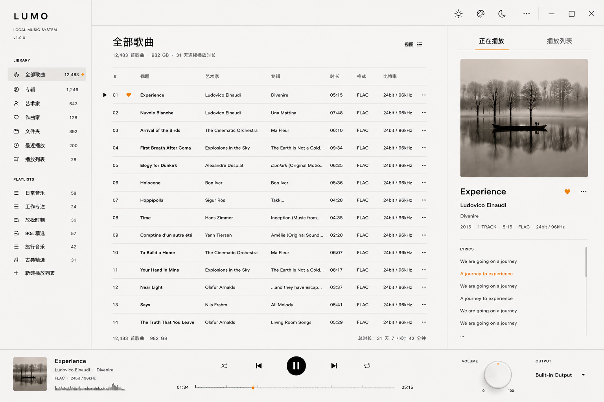

图片 01：艺术家列表页 (LUMO_艺术家列表.png)
视觉预览：

设计说明：
网格与排版系统 (Grid & Typography)：内容区（Region 03）采用 6 列自适应网格。为了打破传统音乐客户端单一乏味的视觉体验，LDL 在艺术家头像上采用了几何交替设计（正方形圆角与圆形交错出现，如第一排中 Ludovico Einaudi 为方，Sigur Rós 为圆）。这赋予了界面如实体艺术杂志（Editorial Layout）般的排版韵律。
内容层级关系：页面头部大字号（42pt）呈现“艺术家列表”，下方副文本显示元数据（643 艺术家 · 982 GB），右侧配以极简的视图切换组件。
导航联动与状态：左侧 Sidebar 中“艺术家 (Artist)”选项呈现 Selected 状态（底色 #F0ECE4，右侧带有一颗微小的微调暖橘色 Accent 指示点），呼应了“一次仅保留一个视觉焦点”的原则。
实物感交互节点：右下角的音量旋钮采用了极轻微的微写实（Skeuomorphic）微光泽与阴影，它是 LDL 体系中少数保留实体工业感（Braun 工业美学）的控制元件，通过物理旋钮的隐喻，消除了扁平化界面的冷淡感。
图片 02：专辑列表页 (LUMO_专辑列表.png)
视觉预览：

设计说明：
高度一致性的网格规范：相较于艺术家页面的几何交替，专辑列表页则严格回归 1:1 的正方形专辑网格（圆角 10px），提供沉浸式的实体黑胶/CD 墙观感。
留白原则的践行：专辑封面与封面之间保持了充足的 24px 间距。专辑名称（Primary, 15pt）与歌手名称（Secondary, 13pt）垂直排列，文字截断与间距严格基于 8pt 栅格，确保高密度信息下依然拥有透气感。
色彩微差与深度：此界面清晰展示了内容区底色（#FBFAF7）与右侧 Inspector 面板底色（#F7F5F1）之间的微妙差别。无需任何投影或厚重的色块，仅靠极细分割线与色温微差便在视觉上对应用进行了分层。
图片 03：文件夹导航页 (LUMO_文件夹.png)
视觉预览：

设计说明：
双栏树状工作区：专为本地 Hi-Fi 音乐发烧友设计的物理文件管理视图。内容区（Region 03）通过垂直细分线（#E8E5DE）再次分隔为两部分：左侧为多层级嵌套的本地文件夹树状图，右侧为当前文件夹（Divenire）内的歌曲列表。
极简图标语言：树状图中的折叠箭头与文件夹 Icon 均采用 1px / 2px Stroke 的极简线框图（如 Phosphor / Lucide 风格），不使用任何带填充或颜色的图标，最大程度保持界面的克制。
状态反馈：当前选中的物理文件夹（Divenire）处于 Selected 状态，填充色为 #F0ECE4。右侧列表中，通过经典的“名称、大小、修改日期”多列排版，将桌面级音乐管理器的专业性与 Warm Minimalism 完美结合。
图片 04：播放列表详情页 — Focus Flow (LUMO_播放列表.png / Focus Flow)
视觉预览：

设计说明：
歌单 Banner 区层级：歌单“Focus Flow”的详情页展示了 LDL 的模块化头部规范。左侧为 1:1 歌单封面（圆角 10px），右侧为歌单名称、简介与核心控制组。
主次按钮逻辑 (Button System)：播放按钮（Play）作为当前页面的 Primary Button，采用了 LDL 标志性的中性暖棕色高亮填充，而旁边的“随机播放”、“分享”与“更多”按钮则采用透明背景、仅在 Hover 时呈现微米色（#F1EFE9）的克制交互。
列表行高与律动：歌曲列表中，当前播放曲目（Row 01: An Ending (Ascent)）采用暖色横幅底色激活，歌名下方配有精致的渐变波形指示条（Waveform Bar），在安静的静态界面中注入了细腻的动态反馈。
图片 05：最近播放记录页 (LUMO_最近播放.png)
视觉预览：

设计说明：
时间维度元数据排版：该页面展示了高密度表格下 LDL 的处理手法。相较于“全部歌曲”，本页增加了“播放时间”一列。通过将时间（如“今日 10:30”、“昨日 22:15”）靠右对齐并使用 Secondary 字体色，让用户在浏览时可以快速过滤时间信息。
局部统计状态栏 (Status Footer)：内容区底部增设了轻量化统计行（元数据：总计时长 31 天 7 小时 42 分钟等），采用极细字体（Caption 11pt）与主分割线隔离，确保这些工具性信息不干扰主列表的视觉纯净度。
图片 06：全部歌曲 master 表格页 (LUMO_全部歌曲.png)
视觉预览：

设计说明：
专业 Hi-Fi 元数据展示：作为 LUMO 的核心视图，此页面展示了极为丰富的数据字段。除标题、艺术家、专辑、时长外，还特别开辟了“格式（FLAC）”与“比特率（24bit / 96kHz）”专属列，强化了 LUMO 作为高品质本地播放器的专业定位。
无框行距控制：本页面完全剔除了传统的表格横线，而是纯粹依靠 24px 的文本行高与优秀的字体对比来引导视线。
当前播放的高亮策略：Row 01 作为当前正在播放的曲目，其序号被替换为微型播放 Icon，且“Experience”歌名旁带有一颗亮橘色的“爱心”指示。这种在极简黑白中突出的微小亮色，起到了极佳的视觉引导效果。
图片 07：专辑详情落地页 (LUMO_专辑详情页面.png)
视觉预览：

设计说明：
经典实体唱片内页排版：头部呈现 Apollo 专辑信息（Brian Eno · 1983 · Ambient）。大面积的左侧白底衬托着小而精致的专辑封面，重现了黑胶唱片歌词本的排版质感。
Hover 状态的视觉化呈现：本图展示了列表行在 Hover 状态下的标准交互规范。Row 05（An Ending (Ascent)）正处于 Hover 状态，背景呈现极淡的米黄色（#F5F2EB），且右侧边缘隐现出“...”更多操作按钮。这种“按需出现（Show on Hover）”的设计，保证了静态界面绝无一丝多余杂质。
图片 08：歌手详情落地页 (LUMO_歌手详情页面.png)
视觉预览：

设计说明：
巨幅人物肖像与传记 (Editorial Layout)：该页面将“Warm Industrial Minimalism”的杂志感排版推向极致。左侧放置大面积正方形艺术家肖像，右侧搭配一段排版优雅、间距考究的生平简介。
二级 Tab 系统切换：“全部歌曲”与“全部专辑”作为页面内的二级分流通道，采用了无背景、仅靠一条极细横线配合 Accent 色的高亮下划线设计。
信息淡入与后退：由于生平简介文字较长，在容器边缘采用了渐变淡出的处理，引导用户的注意力自然过渡到下方的作品列表中。
总结：LUMO 交互的核心硬件感
在以上所有 8 张截图中，底部的 Playback Bar (Region 05) 与 右侧的 Inspector Panel (Region 04) 构成了最坚实的视觉锚点：
Playback Bar：中央的播放/暂停按钮采用了完美的圆形黑色按钮，与左侧的线性波形图进度条、右侧物理质感的音量旋钮交相辉映，创造出了一种如同在操作一台实体 Braun 磁带机或 Teenage Engineering 合成器的指尖安全感。
Inspector Panel：右侧始终静立的歌词与大尺寸黑白风格封面，让用户在任何繁琐的文件整理或列表切换工作中，随时一瞥就能重获对当前音乐的专注。
这套 LDL v1.0 已经超越了临时参考的拼凑，它以温暖中性、结构克制、排版至上的特征，构成了 LUMO 独一无二的高级质感。